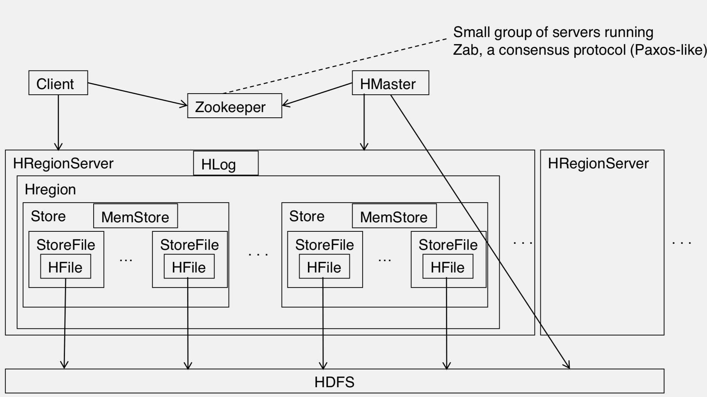
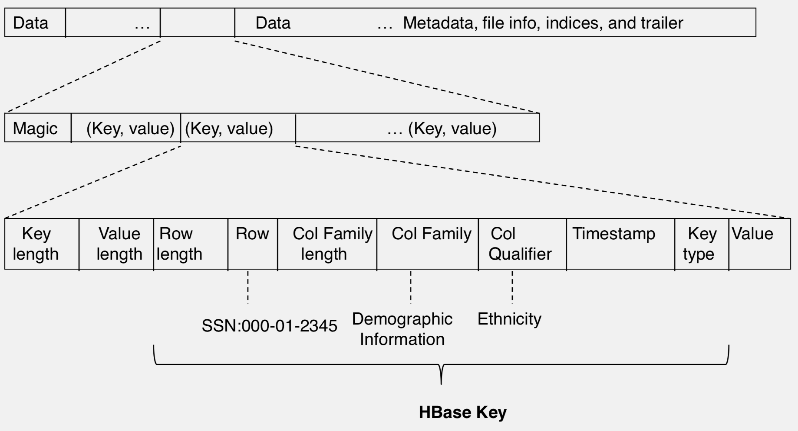
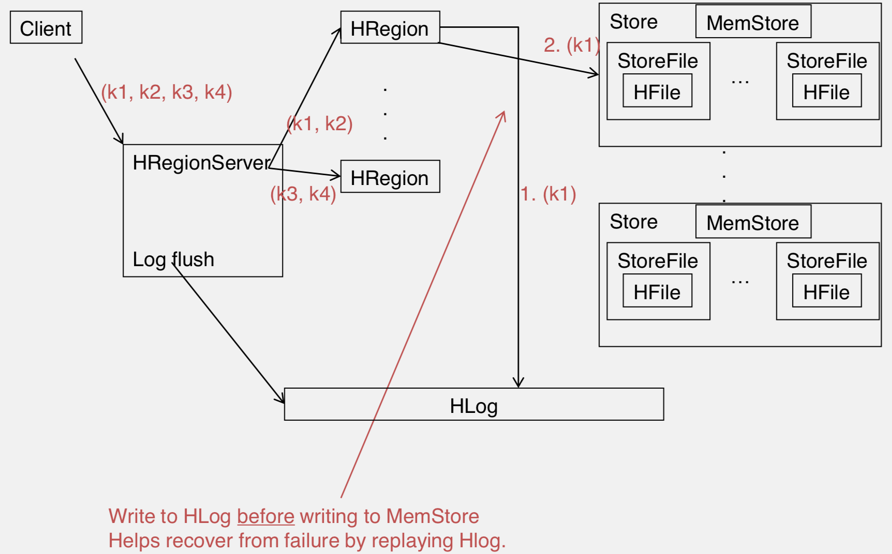

# HBase

## Introduction

HBase is the open-sourced version of Google's BigTable.  Currently Facebook is using it internally.

It provide the following API operations:

* Get/Put (Row level)
* Scan (row range, filter) - range queries
* MultiPut

While Cassandra prefers availability, HBase prefers consistency (over availability) via write-ahead log.

## Architecture



[Column Failily](https://hbase.apache.org/0.94/book/columnfamily.html): Columns in HBase are grouped into *column families*. 

Physically, all column family members are stored together on the filesystem. Because tunings and storage specifications are done at the column family level, it is advised that all column family members have the same general access pattern and size characteristics.


[Regions](https://hbase.apache.org/0.94/book/regions.arch.html) are the basic element of availability and distribution for tables, and are comprised of a Store per Column family.  The hierarchy of objects is as follows:

```{text}
Table       (HBase table)
    Region       (Regions for the table)
         Store          (Store per ColumnFamily for each Region for the table)
              MemStore           (MemStore for each Store for each Region for the table)
              StoreFile          (StoreFiles for each Store for each Region for the table)
                    Block             (Blocks within a StoreFile within a Store for each Region for the table)
 
```

[HFile](https://blog.cloudera.com/blog/2012/06/hbase-io-hfile-input-output/) is SSTable, underlying is HDFS.  Its structure is as following:



## Consistency Guarantee

HBase use write-ahead log to guarantee consistency.  Its mechanism is as the following:



After failure recovery, or bootup, HRegion Server (HMaster) would replays any stale logs (using timestamps to find out where the database is w.r.t. the logs).

The replay also updates MemStore.

## Cross DataCenter Replication

Replication can be used for disaster recovery.  There are three modes for replication:

1. Master-Slave
2. Master-Master
3. Cyclic 

Every mutation are replicated with unique `ClusterID`, and kept intact while storing in "slave" cluster, dead loop can be avoided.

`ClusterID` is a UUID auto generated by HBase for every cluster.  It's kept in underlying filesystem (usually HDFS), so it doesn't change between restarts.

Zookeeper keeps control information of clusters.

More detail can be seen at [Apache HBase Replication Overview](https://blog.cloudera.com/blog/2012/07/hbase-replication-overview-2/).
