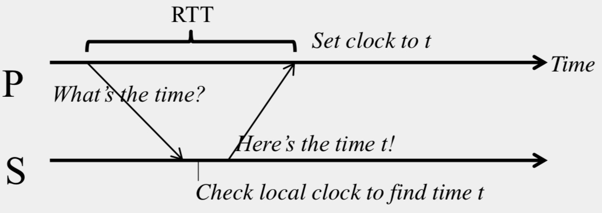
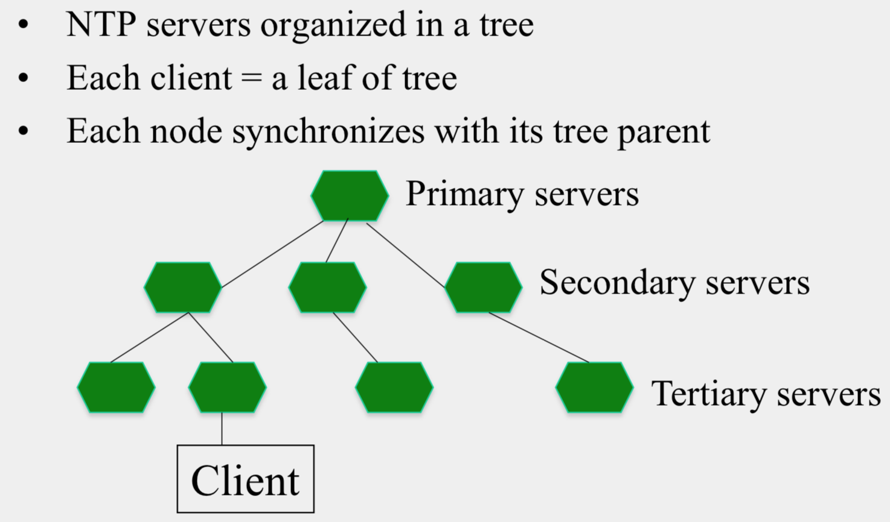
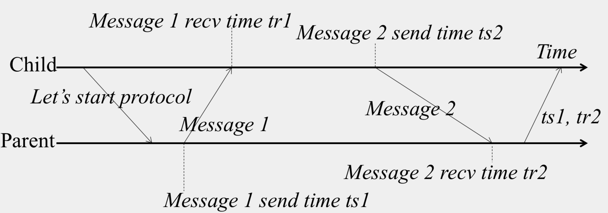
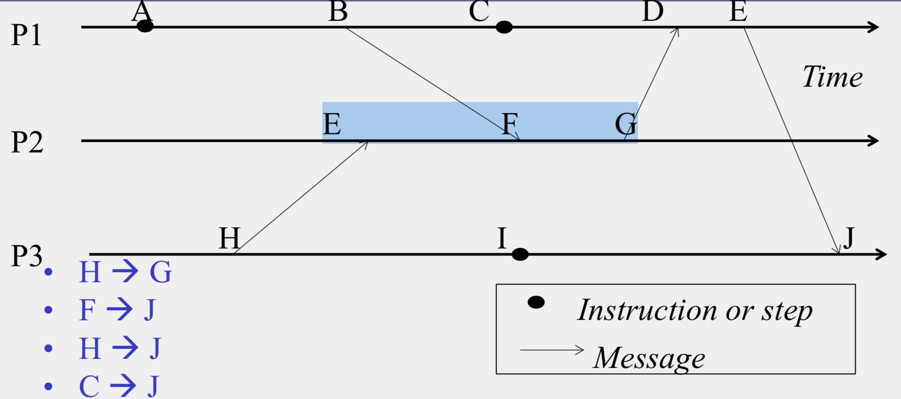
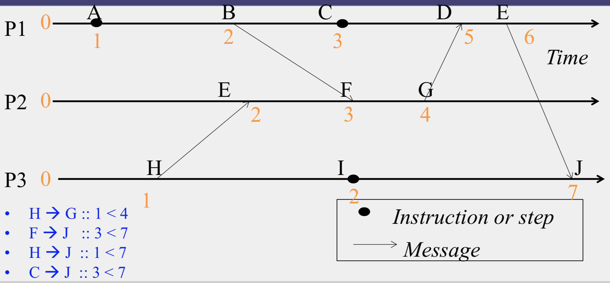
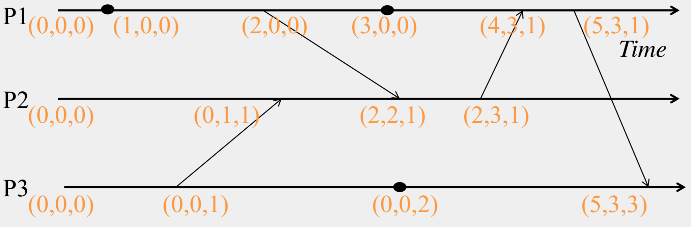
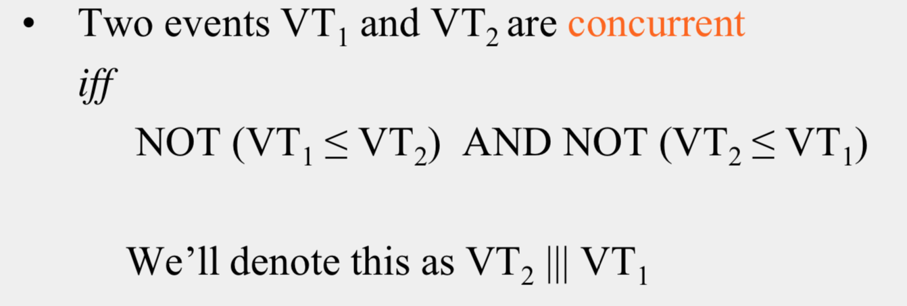
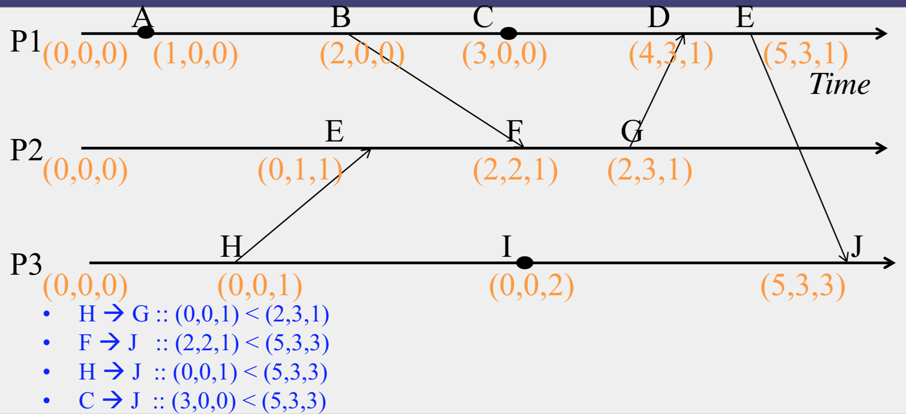
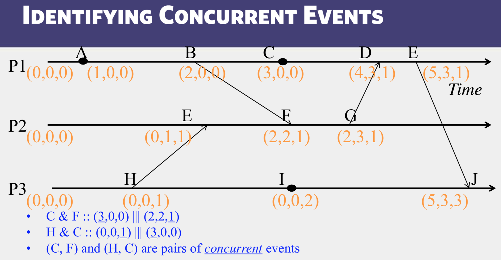

# Time & Ordering

In distributed systems, we need time synchronization for `correctness` and `fairness`.

However, keeping synchronization is quite challenging, because 

1. Each end hosts in Internet-based systems have their own clocks;
2. Processes in Internet-based systems follows an asynchronous system model, in which there are no bounds on message delays and processing delays.

Before solving synchronization, we need to know some concepts about it.

## Related Definitions

An asynchronous distributed system consists of a number of `processes`.

Each `process` has a `state` (values of variables).

Each `process` takes actions to change its `state`, which maybe an `instruction` or communication action (`send`, `receive`).

An `event` is the occurrence of an action.

Each `process` has a local clock - events within a process can be assigned `timestamps`, and thus ordered linearly.

However, we also need to know the time ordering of events across different processes.

To compare the local clocks at two processes, we have two definitions `clock skew` and `clock drift`.

**Clock Skew**: Relative difference in clock values of two processes (similar to distance).

**Clock Drift**: Relative difference in clock *frequencies*(rates) of two processes (similar to speed).

When we say two clocks are synchronized, it means the clock skew is zero.  If clock drift is non-zero, clock skew would increase (eventually).

Under such circumstances, `Maximum Drift Rate`(MDR) is used to define how often synchronization is needed.
Absolute MDR is defined relative to Coordinated Universal Time (UTC). UTC is the "correct" time at any point of time.  Maximum drift between two clocks with similar MDR is `2*MDR`.  So given a maximum acceptable skew M between any pair of clocks, need to synchronize at least once every: M / (2 * MDR) time units.

## How to Synchronize

Depending on time source, there are external and internal synchronization.  Consider a group of processes:

1. External Synchronization
    * Each process C(i)'s clock is within a bound of D of a well know clock S external to the group
    * `|C(i) - S| < D` at all times
    * External clock may be connected to UTC or atomic clock.
    * Algorithms: Cristian's Algorithm, NTP

2. Internal Synchronization
    * Every pair of processes in group have clocks within bound D
    * `|C(i) - C(j)|` < D` at all times
    * Algorithm: Berkeley Algorithm

If you use external synchronization with a bound of D, the internal bound would be of 2*D.

If you use internal synchronization, the entire system may drift away from the external clock S.

## Algorithms for Clock Synchronization

### Cristian's Algorithm (External Synchronization)

In Cristian's algorithm, all processes P synchronize with a time server S. It is designed to alleviate inaccuracy caused by message latencies.  Here is a demo on latency:



P measures the round-trip-time (RTT) of message exchange. Suppose

```{text}
min1 = minimum latency from P to S
min2 = minimum latency from S to P
```

`min1` and `min2` depend on Operating System overhead to buffer messages, TCP time to queue messages, etc.

Then the actual time at P when it receives response is between `[t+min2, t+RTT-min1]`.

The solution of Cristian's Algorithm is: P set its time to halfway through this interval, which is `t + (RTT+min2-min1)/2`.  The error is at most `(RTT-min2-min1)/2`, it's bounded!

How can P measure the value of `min1` and `min2`?  The answer is we cannot.  In implementation, we set `min1 = min2`, so that P set its time to `t + RTT/2`.

Here is a question:

```
Calibrations on a recent version of a (slow) operating system showed that on the client side, there is a delay of at least 5.0 ms for a packet to get from an application to the network interface and a delay of 4.0 ms for the opposite path (network interface to application buffer). The corresponding minimum delays for the server are 2.0 ms and 3.0 ms respectively.

What would be the accuracy of a run of the Cristian's algorithm between a client and server, both running this version of Linux, if the round trip time measured at the client is 26 ms?

```


### NTP (Network Time Protocol)

NTP servers are organized in a tree like this:



First, we define some timestamps for NTP messages:



Child uses the four timestamps to calculate the offset between its clock and parent's clock. `Offset` is defined as:

```{text}
o = (tr1 - tr2 + ts2 - ts1)/2
```

The error is bounded by round-trip time.  How to prove it?  Let's use `oreal` to represent the real offset. So

1. Child is ahead of parent by *oreal*
2. Parent is ahead of child by *oreal*

Suppose the one-way latency of Message 1 is *L1*, and Message 2 is *L2*. But no one know *L1* or *L2*.  Then 

1. tr1 = ts1 + L1 + oreal
2. tr2 = ts2 + L2 - oreal

Subtracting the second equation from the first:

```
oreal = (tr1 - tr2 - ts1 + ts2) / 2 + (L2 - L1)/2
=> oreal = o + (L2 - L1)/2
```

Thus, the error is bounded by round-trip-time.

We have non-zero error, but we cannot get rid of it.

### Lamport Timestamps (Logical Ordering)

**Lamport Ordering** is proposed by Leslie Lamport in the 1970s. Since then, it's used in almost all distributed systems.  In this concept, `Happens-Before` is a logical relation among pairs of events, it's denoted as `→`.  The logical relation has three rules:

1. On the same process, `a → b, if time(a) < time(b)` (using the local clock)
2. If p1 send m to p2: `send(m) → receive(m)`
3. `(Transitivity)` If `a → b and b → c` then `a → c`

The partial order doesn't exist in all pairs of events, if the ordering doesn't exist, we say the pair of events are concurrent.  Here is an example:



In practice, processes need to assign logical (Lamport) timestamp to every event.  These timestamps obey causality.  Here is how Lamport timestamp is assigned.

Each process uses a local counter (clock), which initially is ZERO.

case 1: When a `send` or an `instruction` happens at a process, the counter would increase by one, then the counter is assigned to the event as timestamp.

case 2: for a `receive` (message) event, the counter would be updated by `max(local clock, message timestamp) + 1`

Here is an example of Lamport Timestamp:



In the example, causality results in ordering, but not vice versa. 

1. `H → G :: 1 < 4` (obeying causality)
2. `F → J :: 3 < 7` (obeying causality)
3. `H → J :: 1 < 7` (obeying causality)
4. `C → J :: 3 < 7` (obeying causality)
5. `C → F :: 3 == 3` (No causality)
6. `H → C :: 1 < 3` (No causality)

(C, F) and (H, C) are pairs of `concurrent` events.

Remember that:

`E1 → E2 => timestamp(E1) < timestamp(E2)`, BUT
`timestamp(E1) < timestamp(E2) => {E1 → E2} or {E1 and E2 are concurrent}`

Because we cannot tell the ordering of two events according to timestamp values, we need to upgrade Lamport timestamp to support that, resulting in `Vector Clocks`.

### Vector Clocks

Vector timestamps are similar to Lamport timestamps, but more powerful, because processes can tell the ordering of two events according to timestamp value.

Each process maintains a vector of integer clocks, suppose there are N processes in certain group, then Process *i*'s clock is denoted as `V_i[1..N]`, while `V_i[j]` is *i*'s knowledge of latest events at process *j*.  Here is an example:



The initial value in vector timestamp is all ZEROs.  The vector clock would incremented when

1. On an `instruction` or `send event` at process *i*, it only increments its *i*th element of its vector clock
2. Each message carries the send-event's vector timestamp `V_message[1..N]`, on Receiving a message at process *i*, do the following:
    * `V_i[i] = V_i[i] + 1`
    * `V_i[j] = max(V_message[j], V_i[j]), for j != i`

#### Causally Related

How can we define `causally related`?

For `VT1` and `VT2`,

1. `VT1 = VT2` iff `VT1[i] = VT2[i]`, for all *i = 1..N*
2. `VT! <= VT2` iff `VT1[i] <= VT2[i]`, for all *i = 1..N*

Two events are `causally related` iff `VT1 < VT2`, or `VT2 < VT1`.

`VT1 < VT2` is defined as: `VT1 <= VT2`, and there exists *j* such that `1 <= j <= N & VT1[j] < VT2[j]`.

### Not Causually Related (Concurrent)



Here are some examples on causality

**Obeying Causality**



**Identifying Concurrent Events**



## Summary on Logical Ordering

1. Lamport timestamps
    * Integer clocks assigned to events
    * Obey causality
    * Cannot distinguish concurrent events

2. Vector timestamps
    * Obey causality
    * By using more space, can also identify concurrent events

## References

1. [Clocks and Synchronization](http://books.cs.luc.edu/distributedsystems/clocks.html)