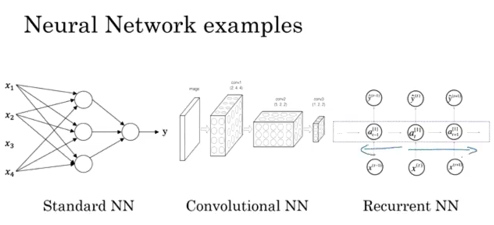
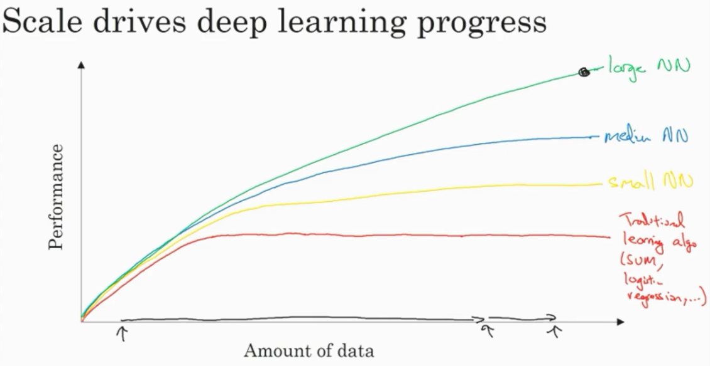
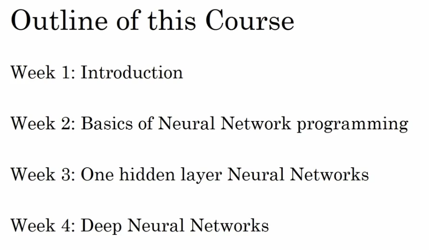

# Introduction to Deep Learning

## Supervised Learning

Use cases of supervised learning:

| Input(x)               | Output(y)                | Application             |
| -----------------------| :------------------------| ----------------------- |
| Home features          | Price                    | Real Estate             |
| Ad, user info          | Click on ad? (0/1)       | Online Advertising      |
| Image                  | Object (1,...,1000)      | Photo tagging           |
| Audio                  | text transcript          | Speech recognition      |
| English                | Chinese                  | Machine translation     |
| Image, Radar info      | Position of other cars   | Autonomous driving      |

About Standard NN, CNN, RNN:

Structured data v.s. Unstructured data

## Drives for deep learning in recent years

Traditional learning algorithm cannot handle large amount of data well.

Outline of this course:

