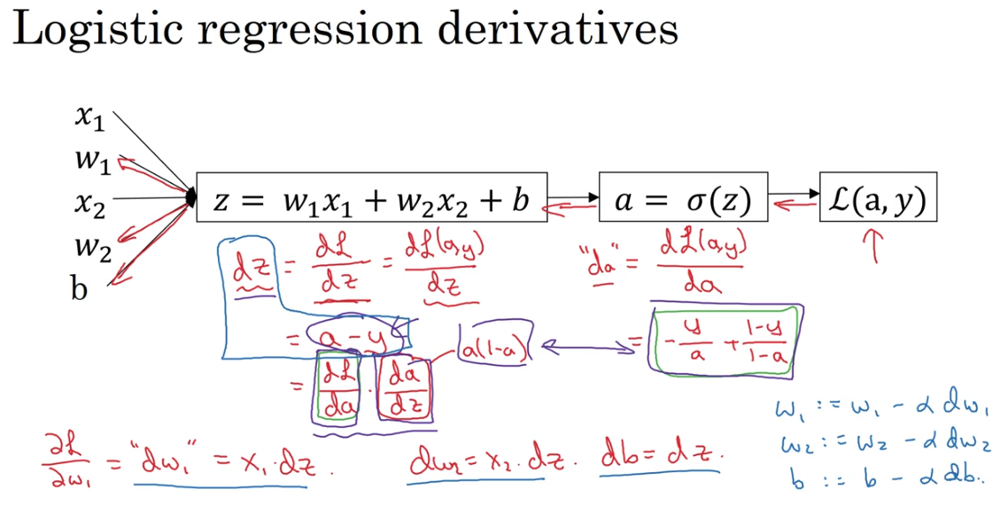
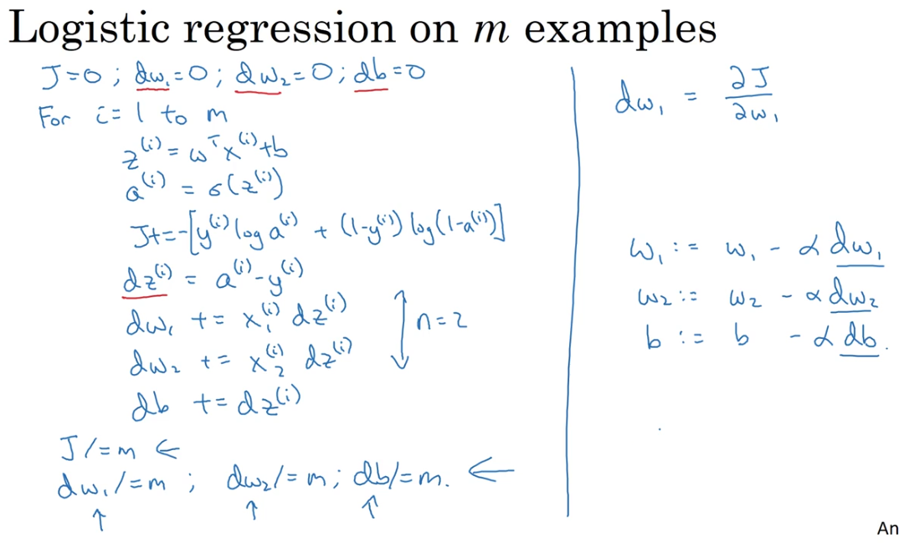

# Classification

## Logistic Regression Formula

The formula of logistic regression are:

$$ z = w^{T} + b$$
$$ \hat{y} = a = \sigma(z) = \frac{1}{1 + e^{-z}}$$
$$ \ell(a, y) = - (ylog(a) + (1-y)log(1-a))$$

the mechanism of back propagation is described as the following:

## Expand the mechanism to `m` examples

How to implement the cost function (calculate `J` and $\frac{d_{J}}{d_{w}}$ in an accumulated way) (not vectorized way)?

## Vectorization

Note that `np.dot()` performs a matrix-matrix or matrix-vector multiplication. This is different from `np.multiply()` and the `*` operator (which is equivalent to `.*` in Matlab/Octave), which performs an element-wise multiplication.