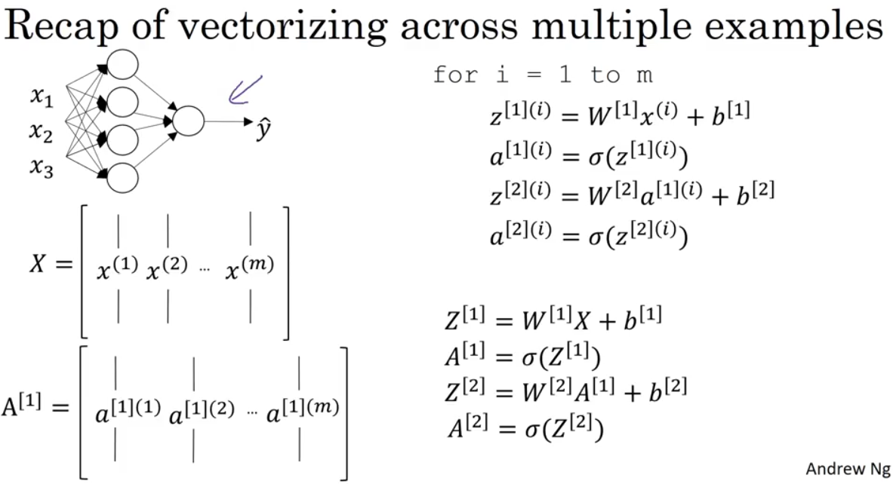

# Shallow Neural Network

## Vectorization across multiple examples

The graph shows the structure of W and A[1]:

## Activation Functions

Activition functions are used to normalize results to [-1,1], [0,1], etc. So we can do classifications to input data.  There are four common used activation functions, they are:

1. sigmoid (Logistic Activation Function)
2. tanh (hyperbolic tangent Activation Function)
3. ReLU (Rectified Linear Unit) Activation Function
4. Leaky ReLU

Often we use `sigmoid` function, but in more general case, we use `ReLU`.

Check [Activition Functions](https://towardsdatascience.com/activation-functions-neural-networks-1cbd9f8d91d6 "activition function") for details.

If there is no activition function, no matter how many layers your neural network has, it's eventually a linear regression.  Thus the hidden layers are meaningless.