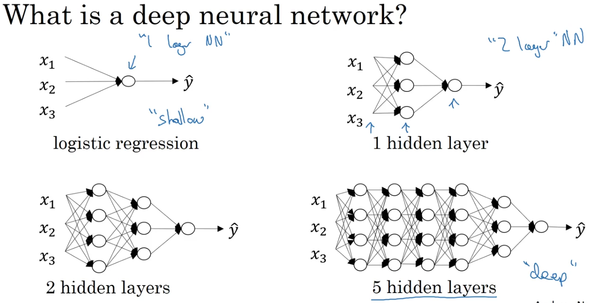
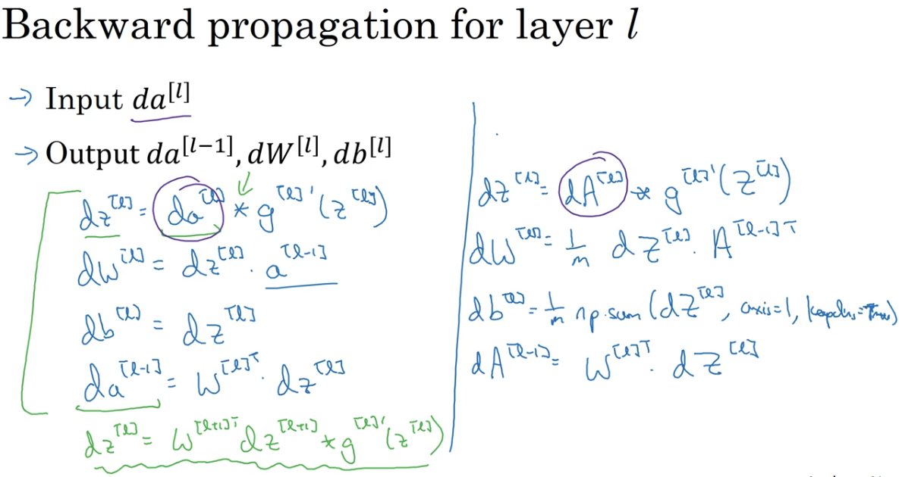

# Deep Neural Network

## What is Deep L-Layer Neural Network

Often we take neural network with only ONE hidden layer as **Shallow neural network**, and those with 2+ hidden layers as **deep neural network**.

## Backward Propagation

For layer `l`,

Input: $da^{[l]}$
Output: $da^{[l-1]}, dW^{[l]}, db^{[l]}$

Here is the formula for the calculation (one sample, not vectorized):

$$dz^{[l]} = da^{[l]} * g^{'}(z^{[l]})$$
$$dW^{[l]} = dz^{[l]} * a^{[l-1]}$$
$$db^{[l]} = dz^{[l]}$$
$$da^{[l-1]} = W^{[l]}.T * dz^{[l]}$$

so we can represent $dz^{[l]}$ as:

$$dz^{[l]} = W^{[l+1]}.T*dz^{[l+1]} * g^{'}(z^{[l]})$$

