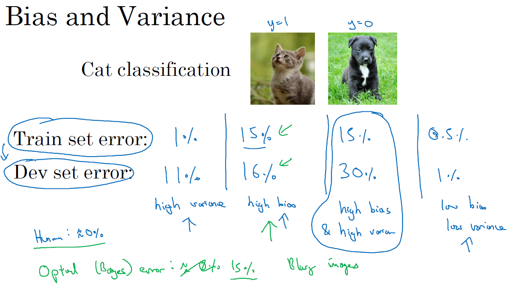
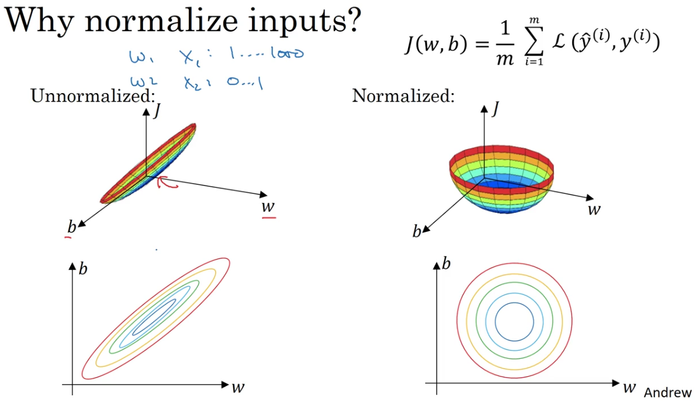

# Introduction to Basic Concepts and Regularization

## Set up your machine learning application

1. You need to prepare `train/dev/test sets` (ratio: 60:20:20, 98:1:1, 99.5:0.4:0.1)

    Note: you must be sure the train set, cross validation set and test set come from the same distribution

2. define
    * \# layers
    * \# hidden units
    * learning rate
    * activation function (relu, sigmoid, leaky relu, tanh)
    * \# iterations

## Bias v.s. Variance

Bias is often related to underfitting, represented as `similar` high training error and cross validation error.  Solutions: 1. bigger network; 2. train longer; (3. new NN model)

Variance is often related to overfitting, represented as low training error and high cross validation error.  Solutions: 1. more data; 2. regularization; (3. new NN model)

Here is some examples:

## Regularization

## Data Preparation

### Normalization

Why do we need normalization?

    Geoffrey Hinton gave a good answer to this in lecture 6-2 of his Neural Networks class on Coursera. This answer will be mainly directed at how input scaling affects a neural net or logistic regression model.

    Essentially, scaling the inputs (through mean normalization, or z-score) gives the error surface a more spherical shape, where it would otherwise be a very high curvature ellipse. Since gradient descent is curvature-ignorant, having an error surface with high curvature will mean that we take many steps which aren't necessarily in the optimal direction. When we scale the inputs, we reduce the curvature, which makes methods that ignore curvature (like gradient descent) work much better. When the error surface is circular (spherical), the gradient points right at the minimum, so learning is easy.

    -- from Daniel Hammack at https://www.quora.com/Why-does-mean-normalization-help-in-gradient-descent

Often we use [standard score](https://en.wikipedia.org/wiki/Normalization_(statistics)) normalization

$X_{in} = (X-\mu)/\sigma$

### Vanishing/Exploding Gradients

Explains why we need small weights ($W^{[i]}$), why we need activation functions.

## Notes on Implementation of Gradient Checking

1. Do NOT use in training - only to debug
2. If algorithm fails grad check, look at components to try to identify bug
3. Remember regularization
4. Doesn't work with dropout. (keep_probs = 1.0)
5. Run at random initialization; perhaps again after some training. (sometimes w,b is too big for your model; run sometime until the w,b are small enough)
