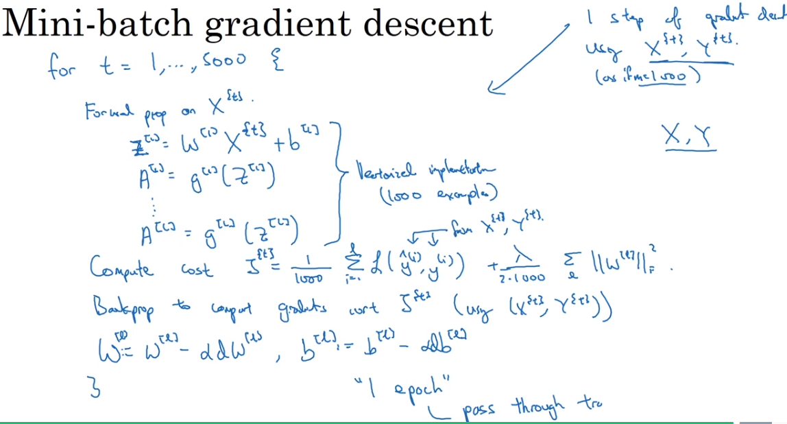

# Optimization Algorithms

## Mini-batch Gradient Descent

What is `epoch`?

In mini-batch gradient descent, is one pass through the `whole` training set.

With mini-batch gradient descent, a single pass through the training set, which is one epoch, allows you to take $m/batch_size$ gradient steps;

Whereas with batch gradient descent, a single pass through the training set allows you to take only one gradient descent step.

For large dataset, mini-batch gradient descent runs much faster than one batch gradient descent.  Why? Because `W` and `b` converge much faster.

### Some mini-batch Examples

1. mini-batch size = m
    * batch gradient descent $(X^{\{1\}}, Y^{\{1\}}) = (X, Y)$

2. mini-batch size = 1
    * stochastic gradient descent
    * lose speed up from vectorization

3. mini-batch size between $(1,m)$
    * not too big, not too small
    * speed up from vectorization
    * make progress without waiting to wait to train the whole training set

### How to Set mini-batch size

1. Small training set:  just use batch gradient descent
    $m <= 2000$

2. big training set: advised size:
    * some recommendations: 64, 128, 256, 512, 1024(rare)
    * you must make sure a batch fit in CPU/GPU memory

## Exponentially Weighted Averages

$$v_{t}=\beta*v_{t-1} + (1-\beta)*\theta_{t}$$

Different $\beta$ has different meanings (take temperature forcast as example):

1. $\beta=0.9$ : 10 days' temperature
2. $\beta=0.98$: 50 days
3. $\beta=0.5$ : 2 days

We unfold the formula, then we get:

$$v_{t} = \sum_{i=t}^{1}(1-\beta)*\beta^{t-i}\theta_{i}$$
where $\theta_{i}$ is the temperature of day $i$.

We already know:

$$(1-\varepsilon)^{1/\varepsilon} = 1/e$$

As to $\beta=0.9$, we get $0.9^{10}\approx 0.35 \approx 1/e$.  After 10 days, the impact of temperature of that day will be less than $1/e$.

### Bias Correction to Exponentially Weighted Averages

Because often we initialize $v_{0}=0$, we will start at a very low value in the warmup phase.

The bias correction can help you get a better estimation early on.

## Gradient Descent with Momentum 

(Based on Exponentially Weighted Averages)

### Questions

1. Why do we need momentum?

    Momentum aims to decrease oscilation in gradient descent.
2. Why `exponentially weighted average` could have momentum?

    

### How to implment gradient descent with momentum

On iteration $t$:

1. Compute $dW, db$ on current mini-batch
2. $v_{dW} = \beta*v_{dW} + (1-\beta)*dW$
3. $v_{db} = \beta*v_{db} + (1-\beta)*db$
4. $W = W - a*v_{dW}, b = b - a*v_{db}$

Hyperparameters: $\alpha, \beta$

## RMSprop

## Adam (Adaptive momentum estimation)

## Learning Rate Decay

One solution is:

$$\alpha = \frac{1}{1+decay\_rate*epoch\_num}$$

## Local Optima

siddle:

Plateaus