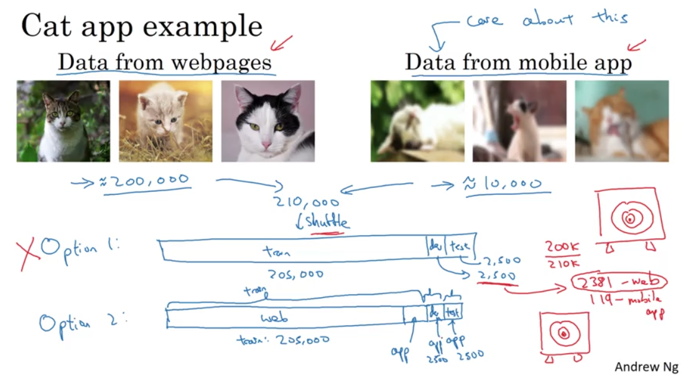
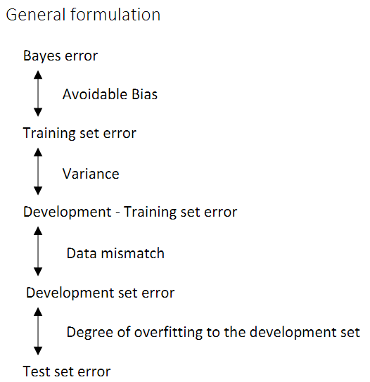

# Carry out Error Analysis

## Learning Objectives

  1. Understand what multi-task learning and transfer learning are
  2. Recognize bias, variance and data-mismatch by looking at the performances of your algorithm on train/dev/test sets

## Carry Out Error Analysis

Assume we have a cat classifier, but the error rate is 10%.  Here we have an idea on classifying dogs:

Should you try to make your cat classifier do better on dogs?

To check this idea, the first thing you should do is not to add features to distinguish dogs, which is time-consuming.  Alternatively, we should check the weight of dogs in the error rate.
The steps are:

1. Get ~100 mislabeled dev set examples.
2. Count up how many are dogs.

If 5 among the 100 are dogs, we do not need to bother to optimize the classifier esp. to dogs.  Because even if we do the best, can only decrease error rate from 10% to 9.5%.
If 50 among the 100 are dogs, it's worth the job. Because to the best, we can decrease the error rate from 10% to 5%.

To extend the idea, we can evaluate multiple ideas in parallel, just like this:

## Clearn up Incorrectly Labeled Data

## Build your first system quickly, then iterate

## Train and Test on Different Distributions

Here is a cat example, we have large dataset from web pages, all high-resolution pics.  But Data from Mobile apps are low-resolution ones (small dataset).  Obviously their distributions are different, how should we set train/dev/test set?

1. shuffle the data, and split (not recommended, because the dataset we care are too small)
2. split data from mobile app by 2:1:1, and put 50% in training set (recommended)

## Bias and Variance with Mismatched Data Distributions

We introduce `training dev set error` to distinguish data mismatch issue, the general formulation is:

## Transfer Learning

When transfer learning makes sense?

1. You have a lot more data for Task A than Task B.
2. Task A and B have the same input x.
3. Low level features from A could be helpful for learning B.

## Multi-task Learning

When multi-task learning make sense?

1. Training on a set of tasks that could benefit from having shared lower-level features
2. Usually, amount of data you have for each task is quite similar
3. Can train a big enough neural network to do well on all the tasks

Summary: multi-task learning enables you to train one neural network to do many tasks, and this can give you better performance than if you were to do the tasks in isolation. (e.g. Computer Vision: object detection)

In practice, transfer learning is used much more often than multi-task learning.

## End-to-end Deep Learning

End-to-end learning ignore the middle steps.
End-to-end learning needs a huge lot of data.

Pros:

1. let the data speak
2. less hand-designing of components needed

Cons:

1. may need large amount of data
2. exlude potentially useful hand-designed components
