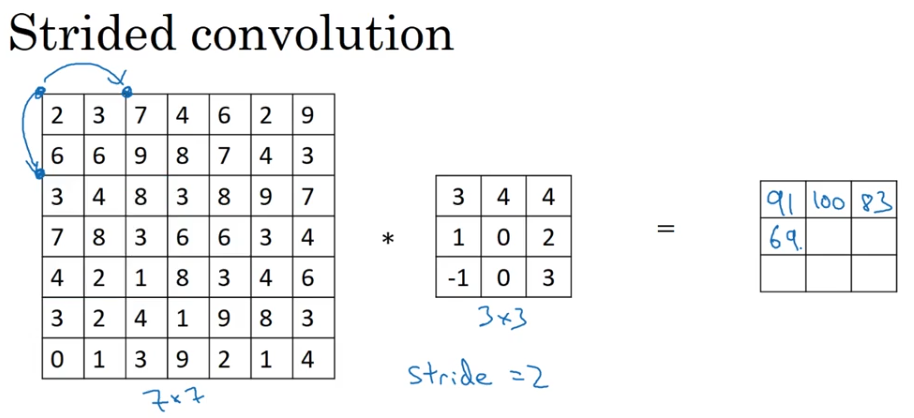
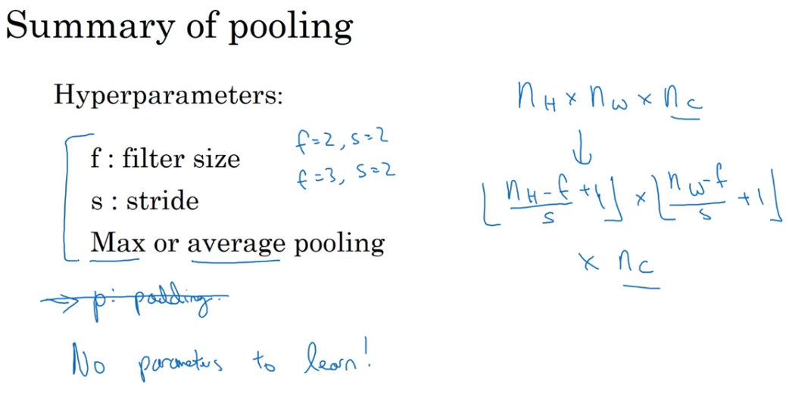
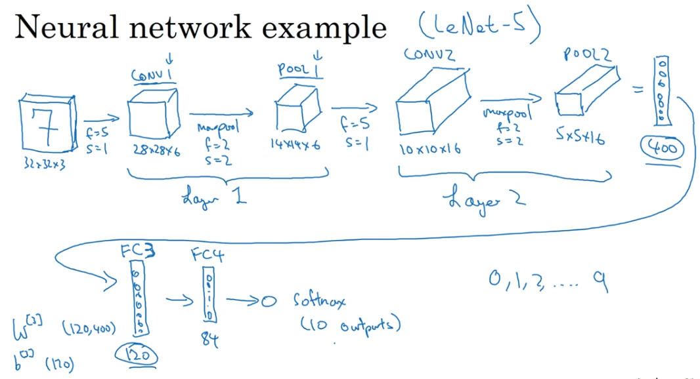
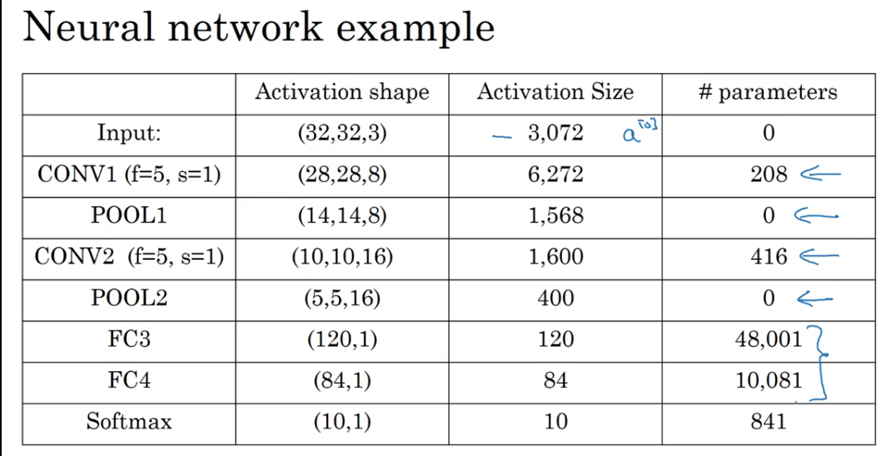

# Introduction to Convolutional Neural Network

## Computer Vision

1. Image Classification/Recognization
2. Neural Style Transfer

We encounter a problem with traditional neural network.  For large pictures, the input dimension would be very large.  For example, a 1000*1000 RGB image, the feature vector size would be `1000*1000*3 = 3 billion`.  How would we solve the problem?


Here we introduce Convolutional neural network.

## Edge Detection Example


Why vertical?  Check the filter matrix


One step further, we can train the filter matrix.  Current question is how to train?

## Padding

Why do we need padding?  What is padding?

First, we check the above convolution.  There are two problems:

1. If you apply a convolutional operator, your image shrinks
2. Pixels in the cornor/edge are less weighted in the output

So we add some padding to the original picture, like this:


### Valid and Same Convolutions

1. Valid: $n \times n * f \times f = (n-f+1)^2$
2. Same: pad so that output size is the same as the input size.

The relation is like this:

$$n+2p-f+1 = n \to p = \frac{f-1}{2}$$
, where $f$ is usually odd.

## Strided Convolutions

What is `stride`?
It's step size.  In the following picture, the `stride` is 2 (not 1).



Then the formula will be:

$$n^2 * f^2 = (\frac{n+2p-f}{s}+1)^2$$


## Technical note on cross-correlation vs. convolution

Check the `*` notation in the following picture.  In mathematics, it's called `cross-correlation` instead of `convolution`.  But in deep learning, we call it a convolutional operation.

Mostly, we do not use the flips, and call the `*` notation `convolution` operator.


## Convolutions on RGB Images

We sum the 27 number together as one in the 4*4 matrix


Here is some parameters that we need to calculate the next layer according to the last layer:


Practice: Suppose your input is a 300 by 300 color (RGB) image, and you use a convolutional layer with 100 filters that are each 5x5. How many parameters does this hidden layer have (including the bias parameters)?

The answer should be 7600!

## Max Pooling

A direct demo on max pooling:


No parameters to learn, all parameters are fixed.



## Sample of a Convolutional Neural Network

Here is a fully-connected neural network.  Often the training continue, $n_H$ and $n_W$ would decrease.



After training, the parameters are like the following:



## Why use Convolutions?

Two advantages of CNN

### Parameter Sharing

Filter matrix are shared.


Parameter Sharing: A feature detector (such as a vertical edge detector) that's useful in one part of the image is possibly useful in another part of the image.

### Sparsity

Sparsity of connections: In each layer, each output value depends only on a small number of inputs.

## Appendices

1. How to index 3D arrays

If you want a slice of [2:4,2:4] of all 3 layers, you should try `X[2:4,2:4]`  (4 excluded)


2. What is the derivative of `np.mean` and `np.max`?

The derivative of `np.mean` is:

```{python}
def distribute_value(dz, shape):
    """
    Distributes the input value in the matrix of dimension shape

    Arguments:
    dz -- input scalar
    shape -- the shape (n_H, n_W) of the output matrix for which we want to distribute the value of dz

    Returns:
    a -- Array of size (n_H, n_W) for which we distributed the value of dz
    """

    ### START CODE HERE ###
    # Retrieve dimensions from shape (≈1 line)
    (n_H, n_W) = shape

    # Compute the value to distribute on the matrix (≈1 line)
    average = dz/n_H/n_W

    # Create a matrix where every entry is the "average" value (≈1 line)
    a = np.ones(shape) * average
    ### END CODE HERE ###

    return a
```

The derivative of `np.max` is:

```{python}
def create_mask_from_window(x):
    """
    Creates a mask from an input matrix x, to identify the max entry of x.

    Arguments:
    x -- Array of shape (f, f)

    Returns:
    mask -- Array of the same shape as window, contains a True at the position corresponding to the max entry of x.
    """

    ### START CODE HERE ### (≈1 line)
    mask = np.max(x)==x
    ### END CODE HERE ###

    return mask
```

3. What Tensorflow APIs do we use in the course?
    * [tf.nn.relu](https://www.tensorflow.org/api_docs/python/tf/nn/relu)
    * [tf.nn.max_pool](https://www.tensorflow.org/api_docs/python/tf/nn/max_pool)
    * [tf.nn.conv2d](https://www.tensorflow.org/api_docs/python/tf/nn/conv2d)
    * [tf.contrib.layers.flatten](https://www.tensorflow.org/api_docs/python/tf/contrib/layers/flatten)
    * [tf.contrib.layers.fully_connected](https://www.tensorflow.org/api_docs/python/tf/contrib/layers/fully_connected)
    * [tf.reduce_mean](https://www.tensorflow.org/api_docs/python/tf/reduce_mean)
    * [tf.train.AdamOptimizer](https://www.tensorflow.org/api_docs/python/tf/train/AdamOptimizer)