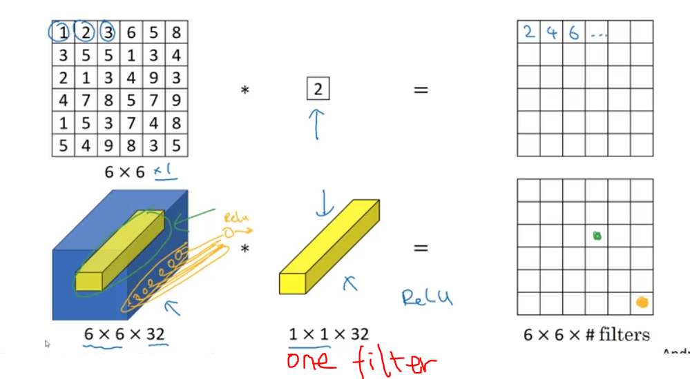

# Case Studies (LeNet-5, AlexNet, VGG, ResNet)

## Outline

Classic networks:

* LeNet-5
* AlexNet
* VGG

ResNet

Inception

## Classic Networks

### LeNet-5


### AlexNet

Parameters: about 60 million


1. Similarity to LeNet, but much bigger
2. Relu
3. Multiple GPUs
4. Local Response Normalization

### VGG-16


## Residual Network (ResNets)

In residual network, we added a shortcut to the normal network. $a_{b+c}$

$$a^{l+2}=g(z^{a+2}+a^{z})$$


It enables us to train much deeper network.


## Networks in Networks and 1*1 Convolutions

What is 1 by 1 convolution? The following image is one `1*1*32` filter



It's used to shrink the number of channels in your volumes or keep it the same or even increase it if you want.

## Inception Network

What is inception network?


Why do we use inception network?

In ConvNet, we pick filters, perhaps 3\*3 filter, or 5\*5 filter, or a polling layer.  In inception network, we can have them all, which works remarkably well.

The problem is too much computation cost, here is an example:


One way to reduce computation cost is to add a `bottle neck` layer.


### How to build a inception network

The graph shows how inception network is built up.


Inception network is built up with many inception modules.

[PPT Inception Network](Inception_Network.pdf)

## Practical Advice for using ConvNets

1. Using open-source implementations

2. Transfer Learning (esp. when you do not have much data)

3. Data Augmentation
    * mirroring (镜像)
    * random cropping (随机切割)
    * Rotation
    * Shearing
    * Local warping
    * Color shifting (PCA color augmentation, will convert all colors to the same)

    Implementating distortions during training:
    

4. The state of computer vision
    * data v.s. hand-engineering
      

5. Tips for doing well on benchmarks/winning competitions

    * Better benchmark is easier to get the paper published;
    * Better benchmark is easier to win a competition
    * it helps the whole community figure out what the most effective algorithm
    * However, in production systems, we usually do not deploy them

```
    there's just a lot of attention on doing well on these benchmarks. And the positive side of this is that, it helps the whole community figure out what are the most effective algorithms. But you also see in the papers people do things that allow you to do well on a benchmark, but that you wouldn't really use in a production or a system that you deploy in an actual application.
```

Possible Techniques:
* Ensembling: train several networks independently and average their outputs.
* Multi-crop at test time: run classifier on mutliple versions of test images and average results

However, in productions systems, we do not use these techniques.


Tips on using open source code:

* use architector of networks published in the literature
* use open source implementations if possible
* use pretrained models and fine-tune on your dataset


## Keras

1. [categorical_crossentropy vs binary_crossentropy](https://stackoverflow.com/questions/41327601/why-is-binary-crossentropy-more-accurate-than-categorical-crossentropy-for-multi/41913968)