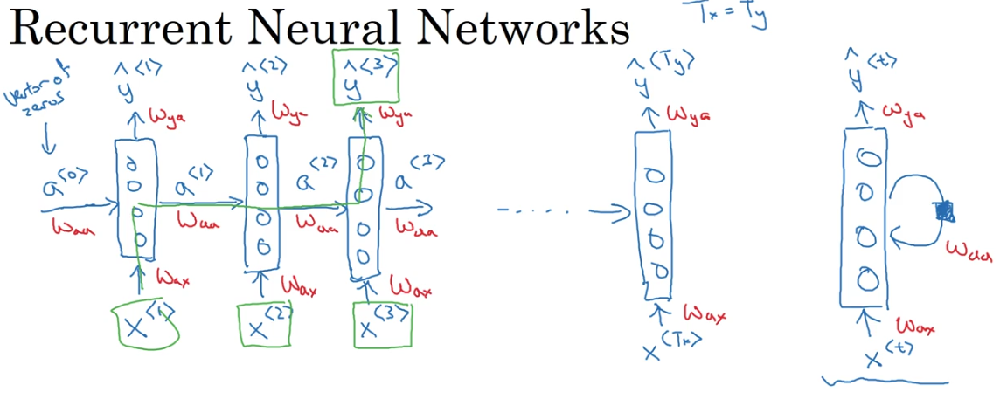

# Recurrent Neural Networks

## Sequence Model

Some use cases:

1. Speech recognition
2. Music generation
3. sentiment classification
4. DNA sequence analysis
5. Machine translation
6. Video activity recognition
7. Name entity recognition

## RNN Notation

The architecture of one directional recurrent neural network:

Forward propagation is done in the following way:

So we can write the notation as:

$$a^{<t>} = g(W_{aa}a_{t-1} + W_{ax}x^{t} + b_a)$$
$$\hat{y}^{<t>} = g(W_{ya}a^{<t>} + b_y)$$

## RNN Backpropagation

At certain time `t`, if the true word is $y_{<t>}$, and the new networks softmax predicted $\hat{y}^{<t>}$, then the lost function can be defined as:

$$\mathcal{L}(\hat{y}^{<t>}, y^{<t>}) = - \sum_{i}{y_{i}^{<t>}log\hat{y}_{i}^{<t>}}$$

$$\mathcal{L} = \sum_{t}{\mathcal{L}(\hat{y}^{<t>}, y^{<t>})}$$

For a sentense, `t` refers to certain word in the sentense.

## Types of RNN

## Language model and sequence generation

Be careful to the difference of sequence generation and sampling novel sentence.

In sequence generation, we use the ground truth words as the input of next layer;
but in sampling novel sentence, we use the random sampled word from softmax distribution.

## Gated Recurrent Unit (GRU)

## Long Short Term Memory (LSTM)

LSTM is the more general version of Gated Recurrent Unit.

structure of LSTM:

### LSTM forward propagation

### LSTM Backward propagation

1. Gate derivatives

$$d\Gamma_{o}^{<t>} = da_{next} * tanh(c_{next}) * \Gamma_{o}^{<t>} * (1-\Gamma_{o}^{<t>})$$
$$d\tilde{c}^{<t>} = dc_{next} * \Gamma_{u}^{<t>} + \Gamma_{o}^{<t>}(1-tanh(c_{next})^2) * i_{t} * da_{next} * \tilde{c}^{<t>} * (1 - tanh(\tilde{c}^2))$$
$$d\Gamma_u^{<t>} = dc_{next}*\tilde c^{<t>} +\Gamma_o^{<t>} (1-\tanh(c_{next})^2) *\tilde c^{<t>} * da_{next}*\Gamma_u^{<t>}*(1-\Gamma_u^{<t>})$$
$$d\Gamma_f^{<t>} = dc_{next}*\tilde c_{prev} + \Gamma_o^{<t>} (1-\tanh(c_{next})^2) * c_{prev} * da_{next}*\Gamma_f^{<t>}*(1-\Gamma_f^{<t>})$$

2. Parameters derivatives

$$ dW_f = d\Gamma_f^{<t>} * \begin{pmatrix} a_{prev} \\ x_t\end{pmatrix}^T$$
$$ dW_u = d\Gamma_u^{<t>} * \begin{pmatrix} a_{prev} \\ x_t\end{pmatrix}^T$$
$$ dW_c = d\tilde c^{<t>} * \begin{pmatrix} a_{prev} \\ x_t\end{pmatrix}^T$$
$$ dW_o = d\Gamma_o^{<t>} * \begin{pmatrix} a_{prev} \\ x_t\end{pmatrix}^T$$

Be attention: here `\\` is different with `\\\\`.

3. Finally

$$da_{prev} = W_f^T*d\Gamma_f^{<t>} + W_u^T * d\Gamma_u^{<t>}+ W_c^T * d\tilde c^{<t>} + W_o^T * d\Gamma_o^{<t>}$$

Here, the weights for the above equation are the first n_a, (i.e. $W_f=W_f[:n_a,:]$, etc...)

$$dc_{prev} = dc_{next}\Gamma_f^{<t>} + \Gamma_o^{<t>} * (1- \tanh(c_{next})^2)*\Gamma_f^{<t>}*da_{next}$$
$$dx^{<t>} = W_f^T*d\Gamma_f^{<t>} + W_u^T * d\Gamma_u^{<t>}+ W_c^T * d\tilde c_t + W_o^T * d\Gamma_o^{<t>}$$

here is the png format:

Question 1: What the $i_t$ means in the calculation of $d\tilde c^{<t>}$?
Question 2: Think the first part is enough, what the second part of formula `(8)` for?
Question 3: the implmentation of `lstm_backward` in `Building a Recurrent Neural Network step by step` 3.3 is wrong, still need to figure out the correct answer.

References:

1. [Building a recurrent neural network](https://www.coursera.org/learn/nlp-sequence-models/notebook/X20PE/building-a-recurrent-neural-network-step-by-step)
2. [Dinosaur Island](https://www.coursera.org/learn/nlp-sequence-models/notebook/MLhxP/dinosaur-island-character-level-language-modeling)