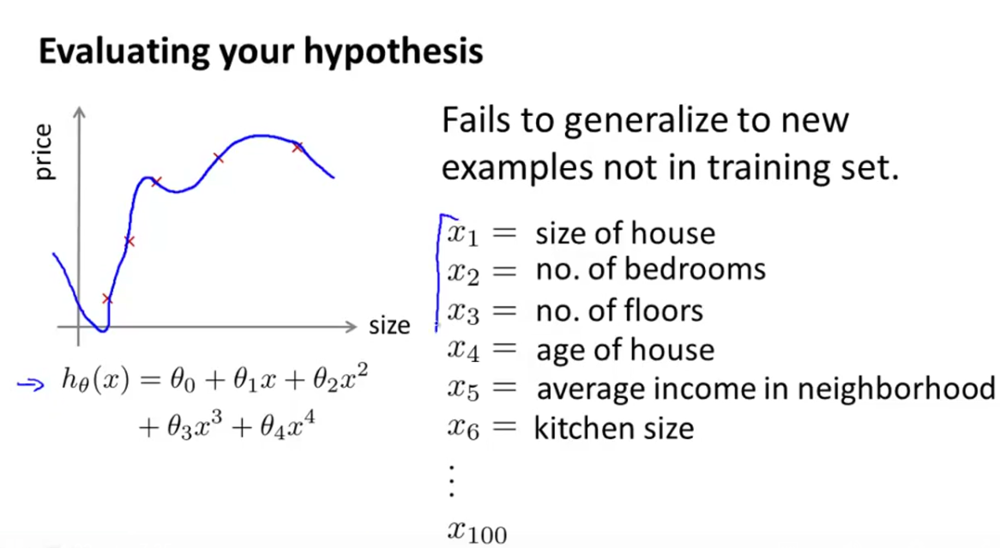
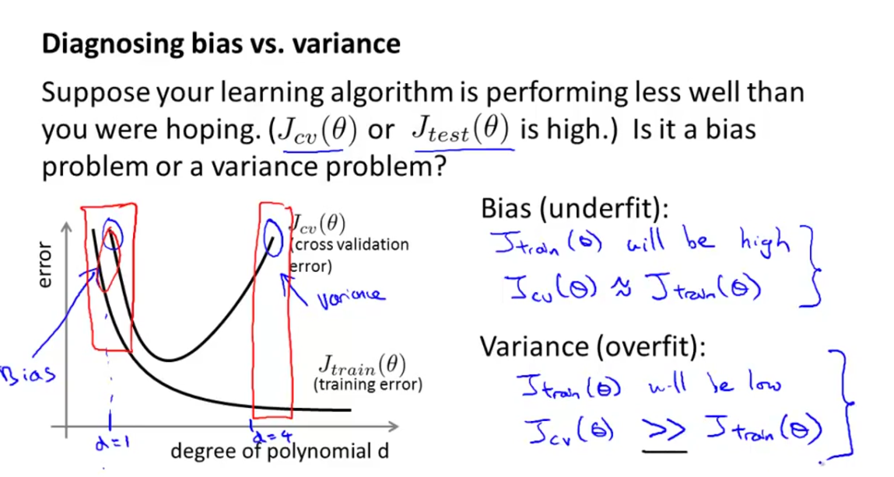
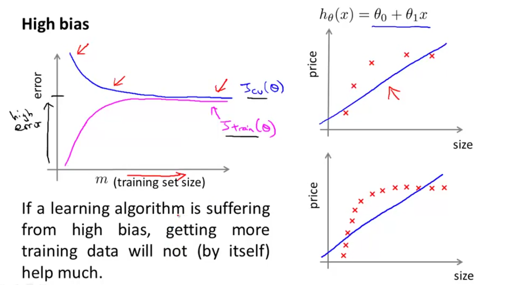
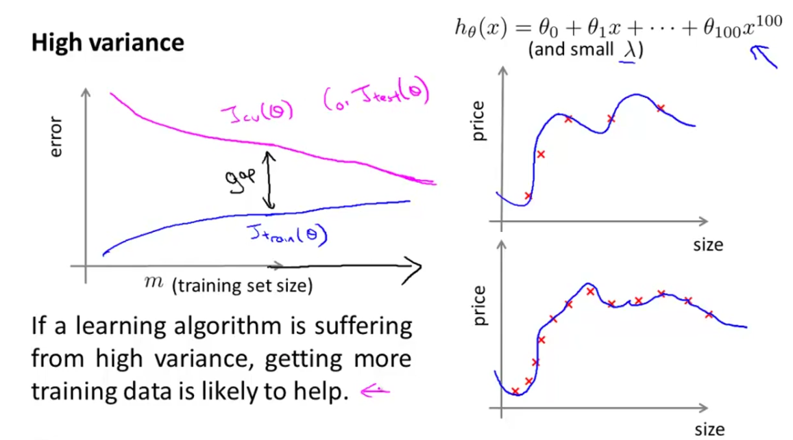
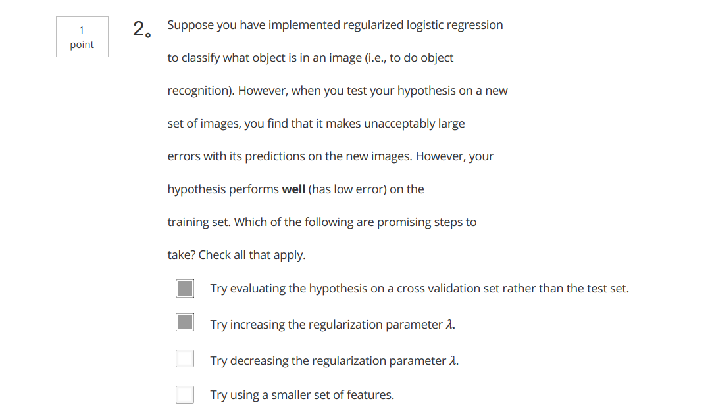
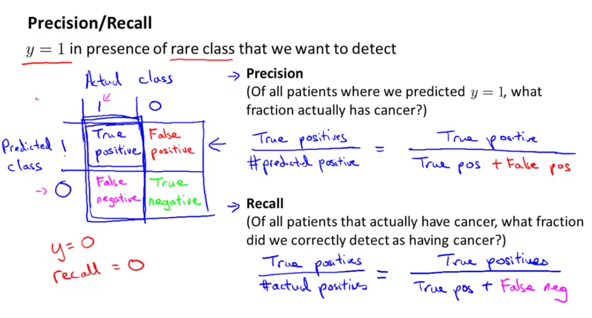
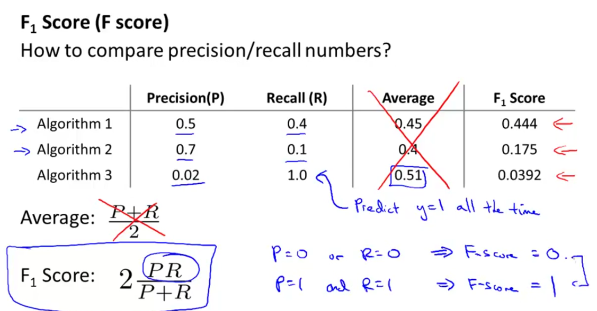

# Advice for Applying Machine Learning

## Debugging a learning algorithm

When your hypothesis makes unacceptably large errors in predictions. What we can do next are:

1. Get more training examples
2. Try smaller sets of features
3. Try getting additional features
4. Try adding polynomial features (X1^2, x2^2, x1*x2, etc.)
5. Try decreasing lambda
6. Try increasing lambda

## Evaluating your hypothesis

Here is an example of overfitting:

To evaluate the hypothesis, we split up the data into two sets: a `training set` and a `test set` (often 70%-30%).

The new procedure using these two sets is then:

1. Learn theta and minimize J(theta) using the training set.

$$Learn\ \theta,\ minimize\ J_{train}(\theta) $$

2. Compute the test set error:

$$J_{test}(\theta)$$

### The test set error

1. For linear regression:

$$J_{test}(\theta)= \frac{1}{2m_{test}}\sum_{i=1}^{m_{test}}(h_{\theta}(x_{test}^{(i)} - y_{test}^{(i)}))^2$$

2. For classification ~ Misclassification error (aka 0/1 misclasiffication error):

$$ err(h_{\theta}(x), y) = 
  \begin {cases} 
    1 & \quad \text{if } h_{\theta}(x)>=0.5\ \text{ and } y = 0 \text{ OR } h_{\theta}(x) < 0.5 \text{ and } y = 1 \\
    0 & \quad \text{otherwise}
  \end{cases}
$$

The average test error for the test set is:

$$\text{Test Error} = \frac{1}{m_{test}}\sum_{i=1}^{m_{test}}err(h_{\theta}(x_{test}^{(i)}), y_{test}^{(i)})$$

This gives us the proportion of the test data that was misclassified.

## Model Selection and Train/validation/Test Sets

One way to break down our dataset into three sets is:

1. Training set: 60%
2. Cross validation set: 20%
3. Test set: 20%

We can now calculate three separate error values for the three different sets using the following method:

1. Optimize the parameters in theta using the training set for each polynomial degree.
2. Find the polynomial degree d with the lease error using the cross validation set.
3. Estimate the generalization error using the test set with 

$$ J_{test}(\theta_{}^{(d)}) $$

where d is theta from polynomial with lower error.

This way, the degeree of the polynomial d has not been trained using the test set.

## How to diagnose bias v.s. variance

The training error will tend to `decrease` as we increase the degree d of the polynomial.

Note: How much bigger is `>>`?

## Regularization and Bias/Variance

If high Bias, more training data is of no help

If high variance, more training data is likely to help.

## Deciding What to Do Next Revisited

Our decision process can be broken down as follows:

* **Getting more training examples:** Fixes high variance
* **Trying smaller sets of features:** Fixes high variance
* **Adding features:** Fixes high bias
* **Adding polynomial features:** Fixes high bias
* **Decreasing λ:** Fixes high bias
* **Increasing λ:** Fixes high variance.

### Diagnosing Neural Networks

* A neural network with fewer parameters is **prone to underfitting**. It is also computationally cheaper.
* A large neural network with more parameters is **prone to overfitting**. It is also computationally expensive. In this case you can use regularization (increase λ) to address the overfitting.

Using a single hidden layer is a good starting default. You can train your neural network on a number of hidden layers using your cross validation set. You can then select the one that performs best.

### Model Complexity Effects:

* Lower-order polynomials (low model complexity) have high bias and low variance. In this case, the model fits poorly consistently.
* Higher-order polynomials (high model complexity) fit the training data extremely well and the test data extremely poorly. These have low bias on the training data, but very high variance.
* In reality, we would want to choose a model somewhere in between, that can generalize well but also fits the data reasonably well.

## Wrong Questions

I chose wrong answers for the question: **low J_train(theta), high J_test(theta)**

I think Only second choice is correct.

## Precision and Recall

Both high precision and high recall means the algorithm is good.

**Null Hypothesis:** No cancer.

1. `false positive` -- `type I error`: incorrectly reject a true null hypothesis;
2. `false negative` -- `type II error`: incorrectly retain a false null hypothesis;

However, `higher precision` means `lower recall`.  The tradeoff is similar to `Type I error` and `Type II error`.

### Tradeoff of Precision v.s. Recall

F-score is used to select better precision and recall.  The following is a way to calculate F-score:

## How much data should we choose

Low bias is guaranteed by algorithm:  `Use a learning algorithm with many parameters (e.g. logistic regression/linear regression with many features; neural network with many hidden units).`

Low variance is guaranteed by `very large training set` (unlikely to overfit).
