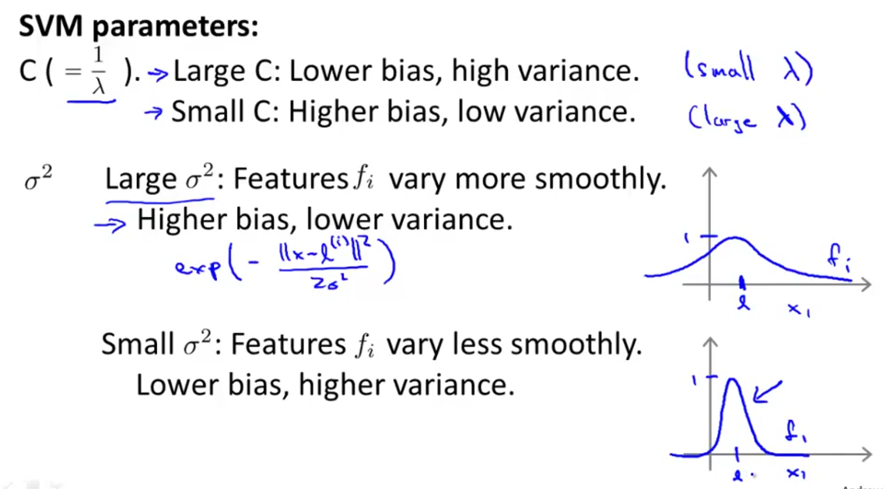

# Support Vector Machine

SVM is a supervised machine learning algorithm.

## Logistic Regression v.s. SVM

The formula of logistic regression and SVM is similar.

### Logistic Regression

$$
J(\theta) = \frac{1}{m}\left[
    \sum_{i=1}^{m}y_{}^{(i)}\left(-logh_{\theta}(x_{}^{(i)})\right) +
      (1-y_{}^{(i)})\left(-log(1-h_{\theta}(x_{}^{(i)}))\right)
  \right] +
\frac{\lambda}{2m}\sum_{j=1}^{n}\theta_{j}^{2}
$$

**Purpose:** find a $\theta$, so that we get a minimum $J(\theta)$.

### SVM

SVM is similar to logistic regression, but the cost function is different.  Its formula is:

$$
f(\theta) = C\sum_{i=1}^{m}\left[y_{}^{(i)}cost_{1}(\theta_{}^{T}x_{}^{(i)}) + (1-y_{}^{(i)})cost_{0}(\theta_{}^{T}x_{}^{(i)})\right] + \frac{1}{2}\sum_{i=1}^{n}\theta_{j}^{2}
$$

**Purpose**: find out a $\theta$, so that we get a minimum $f_{min}(\theta)$.

Be attension that, the cost function of SVM is different with logistic regression.

The decision boundary of SVM is limit to the value of y:

Suppose if C is a very large number, if we want $f(\theta)$ be small, the first part of $f(\theta)$, the $\sum$ part must be ZERO.

## Mathematics Behind Large Margin Classification

### Vector Inner Product

$$ 
u = 
\begin{bmatrix}u_{1}  \\
u_{2} \end{bmatrix}, 

v = 
\begin{bmatrix}v_{1}  \\
v_{2} \end{bmatrix} 
$$

We define the inner product as:

$$u_{}^{T}v = u_{1}v_{1} + u_{2}v_{2}$$.

Define the length of $u$ as:

$$||u|| = \sqrt{u_{1}^2+u_{2}^2}$$

According to the property of [dot product](https://en.wikipedia.org/wiki/Dot_product "dot product"), we know that

$$ a_{b} = ||a||cos\theta,$$
where $\theta$ is the angle between **a** and **b**.

We can infer that:

$$a \cdot b = ||a||\quad||b||\quad{cos\theta} = a_{b} \cdot b = a \cdot b_{a}$$

### Apply Dot Product Properties to $\theta_{}^{T}x_{}^{(i)}$

According to Dot Product properties we describe above, we have the formula:

$$\theta_{}^{T}x_{}{(i)} = ||\theta|| \quad x_{\theta}^{(i)}, $$

where $x_{\theta}^{(i)}$ is the project of $x_{}^{(i)}$ to $\theta$.

**NOTE**: $x_{\theta}^{(i)}$ is not a vector, it's a number.

When $\theta$ is $(\frac{\pi}{2}, \frac{3\pi}{2})$, the dot product of two vectors is negative.

so we can rewrite SVM formula as:

$$f(\theta) = C\sum_{i=1}^{m}\left[y_{}^{(i)}cost_{1}(||\theta||x_{\theta}^{(i)}) + (1-y_{}^{(i)})cost_{0}(||\theta||x_{\theta}^{(i)})\right] + \frac{1}{2}||\theta||^2$$

$$ \frac{\lambda}{2}\sum_{j=1}^{n}\theta_{j}^{2} = \frac{1}{2}||\theta||^2$$

## Interpret SVM function in Dot Product

We take very sample as a vector, for example $x_{}^{(i)}$,

We apply the idea to all samples:

## Kernels

Let's check a complex example, which need polynomial feautures.  Check the following image:

How can we choose features among $f_{1},f_{2},f_{3},...$?

### Kernel and Similarity

We define kernel and similarity as:

$$ f_{1} = similarity(x, l_{}^{(1)}) = exp\left(-\frac{||x-l_{}^{(1)}||}{2\sigma^2}\right) = exp\left(-\frac{\sum_{j=1}^{n}(x_{j}-l_{j}^{(1)})^2}{2\sigma^2}\right)$$

If sample $x$ is very close to $l_{}^{(l)}$, $f_{1}$ is close to 1;

If sample $x$ is far away from $l_{}^{(1)}$, $f_{1}$ will is close to 0.

We use training sample x, we can get the values of $f_{1},f_{2},f_{3}, ...$.

We re-write the SVM (with kernels) in the following way:

$$f(\theta) = C\sum_{i=1}^{m}\left[y_{}^{(i)}cost_{1}(\theta_{}^{T}f_{}^{(i)}) + (1-y_{}^{(i)})cost_{0}(\theta_{}^{T}f_{}^{(i)})\right] + \frac{1}{2}\sum_{i=1}^{n}\theta_{j}^{2}$$

Here, $n$ equals to $m$.

### Kernel Paramters

Parameters that affect:

1. C (= $\frac{1}{\lambda}$)
2. $\sigma^2$

## Use Case

When to use logistic regression? When to use SVM with kernels?

## Error homework

## Related Algorithms

1. [Sequential Minimal Optimization](https://en.wikipedia.org/wiki/Sequential_minimal_optimization "SMO")