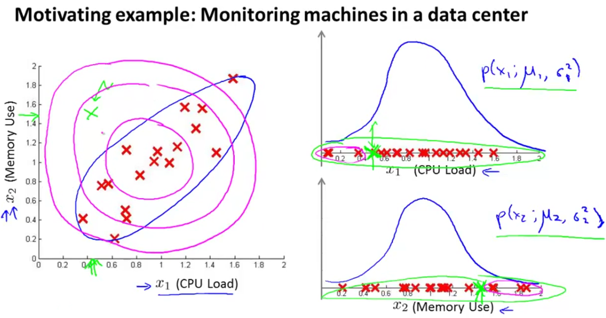
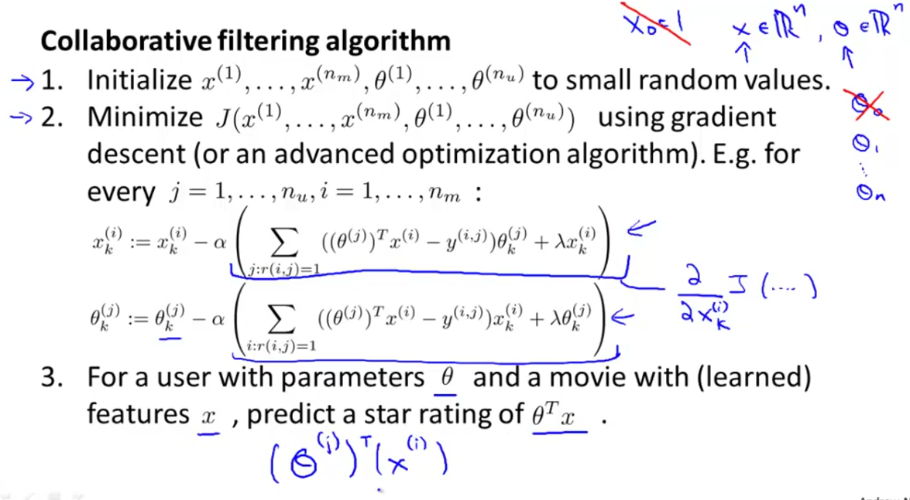

# Anomaly Dedection

## Use Case

1. Fraud detection

    $x^{(i)}$  = features of user $i$'s activities
    
    Model $p(x)$ from data.

    Identify unusual users by checkingg which have $p(x) < \varepsilon$

2. Manufacturing

3. Monitoring computers in a data center

    $x^{(i)}$  = features of machine $i$

    $x_{1}$ = nmemory use, $x_{2}$ = number of disk accesses/sec, $x_{3}$ = CPU load, $x_{4}$ = CPU load/network traffic. etc.

## Gaussian Distribution (Normal distribution)

$$p(x, \mu, \sigma^2) = \frac{1}{\sqrt{2\pi}}exp(-\frac{(x-\mu)^2}{2\sigma^2})$$

## Anomaly detection algorithm

1. Choose feature $x_{i}$ that you think might be indicative of anomalous examples;
2. Fit paramters $\mu_{1},...,\mu_{n},\sigma_{1}^2,...,\sigma_{n}^2$

$$ \mu_{j} = \frac{1}{m}\sum_{i=1}^{m}x_{j}^{(i)}$$
$$ \sigma_{j}^2 = \frac{1}{m}\sum_{i=1}^{m}(x_{j}^{(i)} - \mu_{j})^2$$

3. Given new example x, compute $p(x)$:

$$p(x) = \prod_{j=1}^{n}p(x_{j};\mu_{j},\sigma_{j}^{2}) = \prod_{j=1}^{n}\frac{1}{\sqrt{2\pi}\sigma_{j}}exp(-\frac{(x_{j}-\mu_{j})^2}{2\sigma_{j}^2})$$

Anomaly if $p(x) < \varepsilon$

How to evaluate algorithm?


## Anomaly detection v.s. Supervised learning

1. When to use which

Anomaly detection: for very small number of postive examples(y=1) and very large
number of negative (y=0) examples.

Superivised learning: for large number of both positive and negative examples.

**Noted**: As to anomaly detection, if there exists many different "types" of anomalies, it'll be hard for any algorithm to learn from postive examples what the anomalies look like.  And future anomalies may look nothing like any of the anomalous examples we've seen so far.

But as to supervised learning, enough positive examples for algorithm to get a sense of what postive examples are like, future postive examples likely to be similar to ones in training set.

| Anomaly detection                       | Supervised learning                   |
| ----------------------------------------| :------------------------------------ |
| Very small number of positive examples and large number of negative ones | Very large number of postive and negative examples  |

2. Use Case

| Anomaly detection                   | Supervised learning                   |
| ------------------------------------| :------------------------------------ |
| Fraud detection                     | Email spam classification             |
| Manufacturing (eg. aircraft engines)| Weather prediction (sunny/rainy/etc.) |
| Monitoring machines in a data center| Cancer classification                 |

## Feature Selection

**Prerequisite**: The distribution must be normal or nearly normal.

For skewed distribution, $log, sqrt, polynomial functions$ could possibly convert the distribution to normal distribution.

```{matlab}
histogram
```

Choose features whose distribution is normal distribution.

## Multivariate Gaussian Distribution



The problem in the graph is: the actual distribution is an ellipse, but not circle, leading to bad predictions.  So we introduce multivariate normal distribution.

**Idea**: let $x \in R^{n}$. Don't model $p(x_{1}), p(x_{2}), ... ,$ etc. separately.  Model $p(x)$ all in one go.

Parameters: $\mu \in R^{n}, \Sigma \in R^{n\times{n}}$ (covariance matrix)

As we change the $\mu$ and $\Sigma$, we'll get different distributions.

$\Sigma$ is a matrix to do linear transformation.

The following is a few examples on simple linear transformations:


$\mu$ will affect the location of the distribution:


### How to do estimation with the above concept

We use the fomular to calcuate probability

$$p(x; \mu; \Sigma) = \frac{1}{(2\pi)^{\frac{n}{2}}|\Sigma|^{\frac{1}{2}}}exp\left(-\frac{1}{2}(x-\mu)^{T}\Sigma^{-1}(x-\mu)\right)$$

Given the training set ${x^{(1)}}, {x^{(2)}}, ..., {x^{(m)}}$

$$ \mu = \frac{1}{m}\sum_{i=1}^{m}x^{(i)}$$
$$ \Sigma = \frac{1}{m}\sum_{i=1}^{m}(x^{(i)} - \mu)(x^{(i)} - \mu)^{T}$$

if $p(x) < \varepsilon$, the sample is flagged as anomaly.

## Comparison between Original model and multivariate gaussian

If there are correlations between models, prefer multivariate gaussian.


## Recommendation Algorithm (Content based)

### Definitions

$r(i,j) = 1$ if user j has rated movie i (0 otherwise)

$y^{i,j}$ = rating by user j on movie i (if defined)

$\theta^{(j)}$ = parameter vector for user j

$x^{(i)}$ = feature vector for movie i

For user j, movie i, predicted rating: $(\theta^{(j)})^{T}(x^{(i)})$

$m^{(j)}$ = number of movies rated by user j

Optimization Objective:

To learn $\theta^{(j)}$ (parameter for user j):

$$min_{\theta^{(j)}}\frac{1}{2} \sum_{i:r(i,j)=1}\left((\theta^{(j)})^{T}x^{(i)} - y^{(i,j)}\right)^2 + \frac{\lambda}{2}\sum_{k=1}^{n}(\theta_{k}^{(j)})^2$$

To learn $\theta^{(1)}, \theta^{(2)},...,\theta^{(n_{u})}$:

$$min_{\theta^{(1)},...,\theta^{(n_{u})}}\frac{1}{2}\sum_{j=1}^{n_{u}} \sum_{i:r(i,j)=1}\left((\theta^{(j)})^{T}x^{(i)} - y^{(i,j)}\right)^2 + \frac{\lambda}{2}\sum_{j=1}^{n_{u}}\sum_{k=1}^{n}(\theta_{k}^{(j)})^2$$

Cost function is as the following:


## Recommendation System: Collaborative Filter

The cost function Cost function of movies (denoted with $x^{(i)}$) is:

$$\displaystyle \min_{x^{(1)},...,x^{(n_m)}} \frac{1}{2}\sum_{i=1}^{n_m}\sum_{j:r(i,j)=1}\left((\theta^{(j)})^T x^{(i)}-y^{(i,j)}\right)^2 + \frac{\lambda}{2}\sum_{i=1}^{n_m}\sum_{k=1}^n(x_k^{(i)})^2$$

the gradient descent update rule for $i\neq 0$ is:

$$x_k^{(i)} := x_k^{(i)} - \alpha\left(\sum_{j:r(i,j)=1}\left((\theta^{(j)})^T(x^{(i)}) - y^{(i,j)}\right)\theta_k^{(j)}+ \lambda x_k^{(i)}\right)$$


Combine the two cost function into one:


The algorithm's workflow is as follows:



## Vectorization

## References

1. [Sparsity Problem](http://recommender-systems.org/collaborative-filtering/ "Sparsity")
2. [F1 Score](https://en.wikipedia.org/wiki/F1_score "F1 score")
