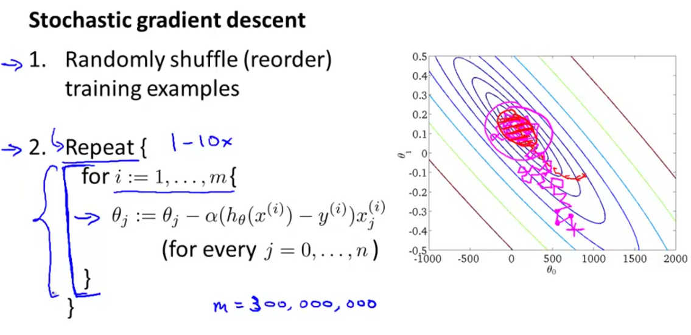
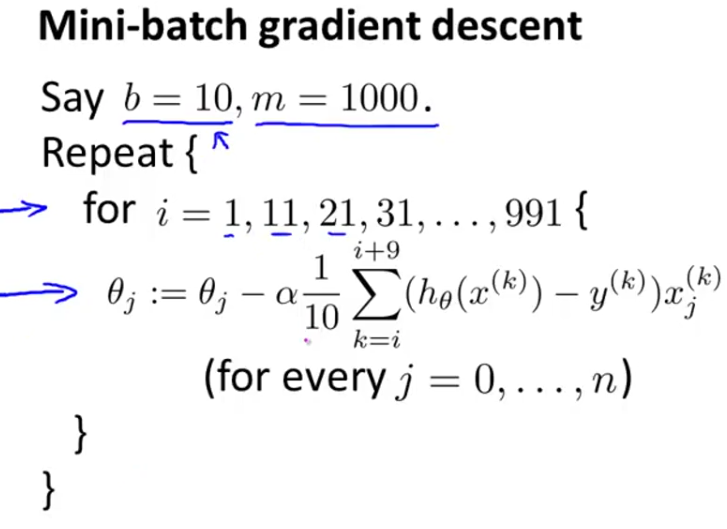
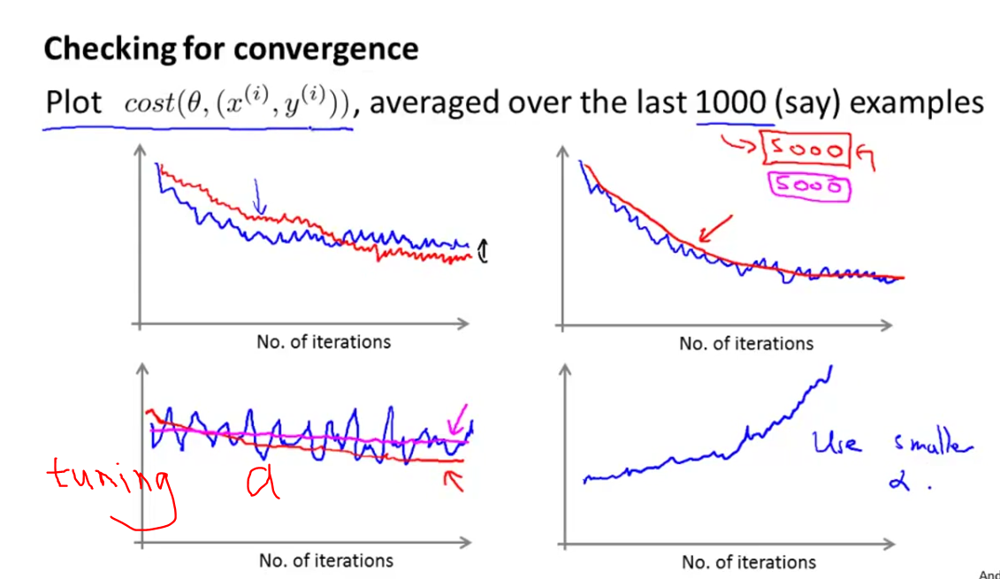
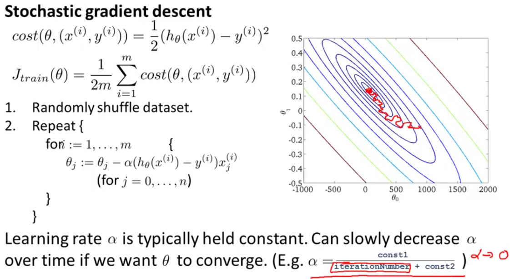
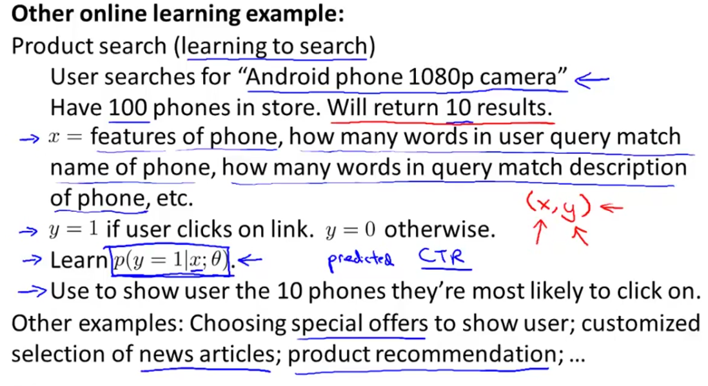
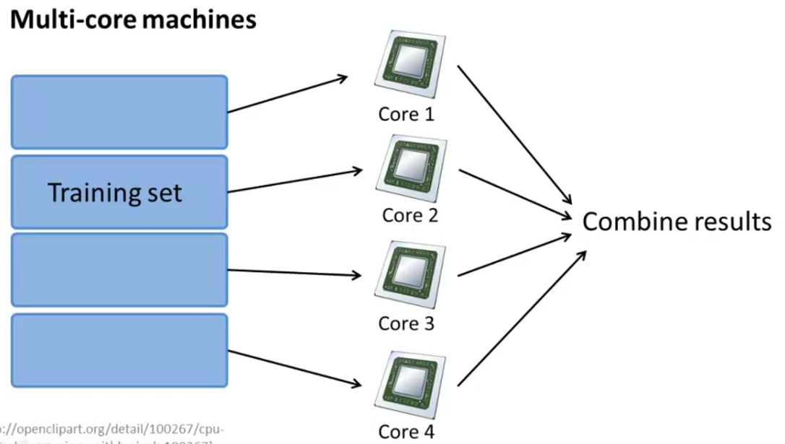

# Large Dataset

Assume m = 100,000,000, if u get high variance of J when m = 1000, increasing m is useful.

## Linear regression with gredient descent

**Stochastic gradient descent**: Use 1 example in each iteration.
**Mini-batch gradient descent**: Use b examples in each iteration.

where b can be 2~100.

### Stochastic Gradient Decent



```{plain}
A compromise between computing the true gradient and the gradient at a single example is to compute the gradient against more than one training example(called "mini-batch") at each step.  Theis can perform significantly better than "true" stochastic gradient descent described, because the coe can make use of vectorization libraries rather than computing each step separately.  It may also result in smoother convergence, as the gradient computed at each step uses more training examples.

--From Wikipedia
```

### Mini-batch gredient descent



## Convergence of stochastic gradient decent





## Online Learning



## Large Scale Machine Learning

Use Map Reduce to speed up the calculation of gradient

[map reduce](images/map_reduce_gradient_descent_calculation.png)

you can also use Multi-cores to do calculations:



Some libraries enable this by default.

## References

1. [Wikipedia: Stochastic Gradient Descent](https://en.wikipedia.org/wiki/Stochastic_gradient_descent, "gradient")
