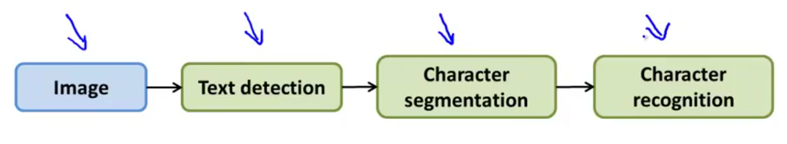
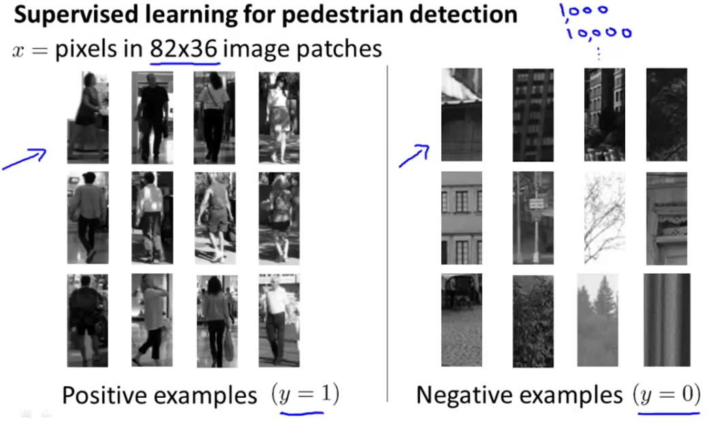
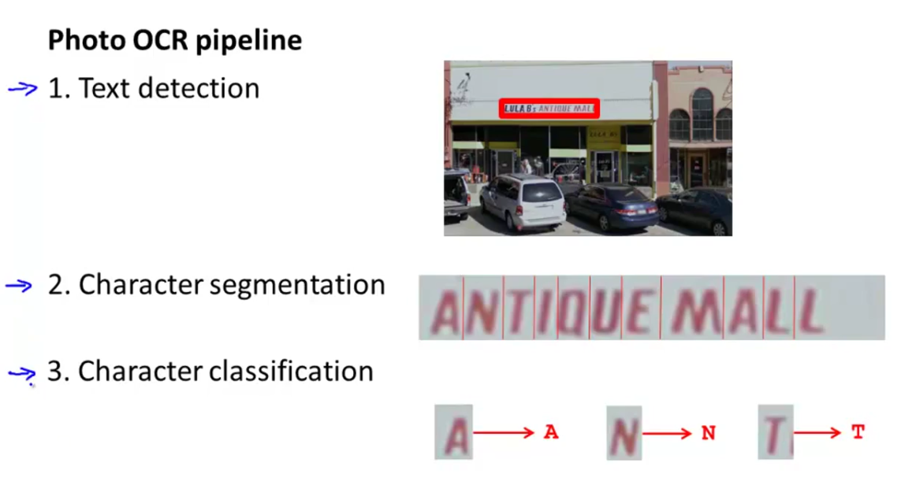
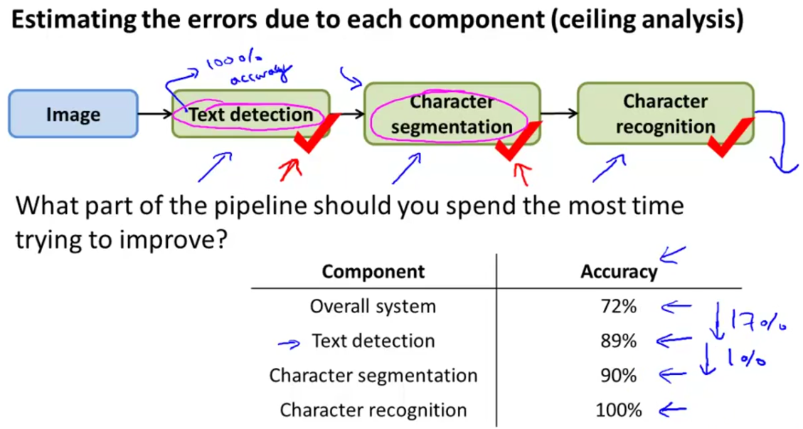
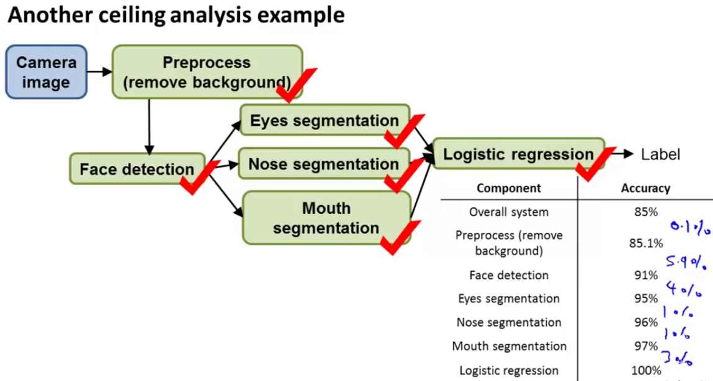
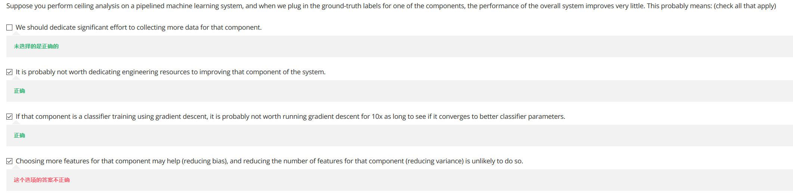

# Photo OCR

The pipline of photo OCR is:

## Sliding windows

Supervised learning for pedestrian detection

**Photo OCR pipeline**:

## Discussion on getting more data

1. Make sure you have a low bias classifier before expanding the effort. (Plot learning curves).  E.g. keep increasing the number of features/number of hidden units in neural network until you have a low bias classifier.

2. "How much work would it be to get 10x as much data as we currently have?"
    - Artificial data synthesis
    - Collect/label it yourself (how many hours?)
    - "Crowd source" (e.g. Amazon Mechanical Turk)

## Ceiling Analysis

Here we use OCR example to show where to improve the accuracy:

