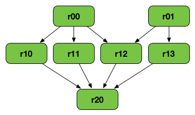

# RDD Lineage - Logical Execution Plan

[文档](https://books.japila.pl/apache-spark-internals/apache-spark-internals/rdd/spark-rdd-lineage.html)

RDD Lineage，也叫 RDD 操作图或RDD依赖图，是一张包含所有parent RDD的图。它被构建出来，是对 RDD 执行 transformation 然后创建逻辑执行计划的结果。

Tips: 执行DAG/物理执行计划 是指 DAG of stages。

下面这张图使用到了 cartesian/zip ，仅用于学习目的。你也可以使用其他操作符构建RDD graph：



上面这个RDD是一组transformation 的结果：

```
var r00 = sc.parallelize(0 to 9)
var r01 = sc.parallelize(0 to 90 by 10)
var r10 = r00 cartesian r01
var r11 = r00.map(n => (n, n))
var r12 = r00 zip r01
var r13 = r01.keyBy(_/20)
var r20 = Seq(r11, r12, r13).foldLeft(r10)(_ union _)
```

一个 RDD lineage graph 是 action 被触发以后，包含待执行的transformation的图。
通过 `RDD.toDebugString` 方法可以了解更多细节。

## Logical Execution Plan

逻辑执行计划起始于最早的RDD（不依赖其他任何RDD或cached数据），结束于action触发以后能产出结果的RDD。

SparkContext 被要求执行 Spark Job 时，逻辑执行计划（比如DAG） 会被实例化并执行。

## 读取 RDD lineage graph

通过 `toDebugString` 方法，比如：

```scala
scala> val wordCount = sc.textFile("README.md").flatMap(_.split("\\s+")).map((_, 1)).reduceByKey(_ + _)
wordCount: org.apache.spark.rdd.RDD[(String, Int)] = ShuffledRDD[21] at reduceByKey at <console>:24

scala> wordCount.toDebugString
res13: String =
(2) ShuffledRDD[21] at reduceByKey at <console>:24 []
 +-(2) MapPartitionsRDD[20] at map at <console>:24 []
    |  MapPartitionsRDD[19] at flatMap at <console>:24 []
    |  README.md MapPartitionsRDD[18] at textFile at <console>:24 []
    |  README.md HadoopRDD[17] at textFile at <console>:24 []
```

出现 shuffle 时，`toDebugString`会打印出一个缩进。
圆括号内的数字表示每个stage里的并法度，比如上面例子里的 `(2)`

```scala
scala> wordCount.getNumPartitions
res14: Int = 2
```

在运行 Spark 任务时，可以启用 `spark.logLineage` 参数，在执行一个action时，`toDebugString` 会被打印到日志里。

```
$ ./bin/spark-shell --conf spark.logLineage=true

scala> sc.textFile("README.md", 4).count
...
15/10/17 14:46:42 INFO SparkContext: Starting job: count at <console>:25
15/10/17 14:46:42 INFO SparkContext: RDD's recursive dependencies:
(4) MapPartitionsRDD[1] at textFile at <console>:25 []
 |  README.md HadoopRDD[0] at textFile at <console>:25 []
```
