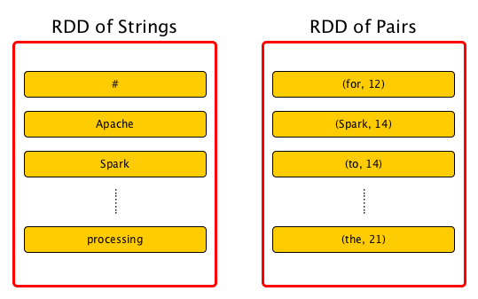
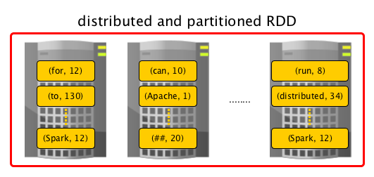

# Resilient Distributed Dataset (RDD)

[出处](https://books.japila.pl/apache-spark-internals/apache-spark-internals/rdd/index.html#preferredLocations)

RDD 是 Apache Spark 最基本的数据抽象，也是 Spark Core。

RDD的概念源于[Resilient Distributed Datasets: A Fault-Tolerant Abstraction for In-Memory Cluster Computing](https://cs.stanford.edu/~matei/papers/2012/nsdi_spark.pdf) by Matei Zaharia, et al.


An RDD is a description of a fault-tolerant and resilient computation over a distributed collection of records (spread over [one or many partitions](https://books.japila.pl/apache-spark-internals/apache-spark-internals/rdd/index.html#getPartitions)).


Note
```
可以把 RDD 雷雨成 Scala 里的 collections，区别在于 一个RDD 在多个 JVM 上进行计算，而 Scala collection 只在一个 JVM 里。
```

借助于 RDD，Spark 将数据的分区和分布隐藏起来，设计出了并行计算框架，并为四种主流编程语言提供了高层次的API。

RDD 的特性有：
1. Resilient. 通过 RDD lineage graph 支持 fault-tolerance，能够对丢失/损坏的分区重新计算（可能原因：node failure）
2. Distributed. 数据存在于 Spark 集群里的多个节点上。todo: 什么是spark cluster？
3. Dataset. 一组分区数据的集合，每条记录可以是任意类型，比如 tuple, string 等



Scaladoc 中对 [org.apache.spark.rdd.RDD](http://spark.apache.org/docs/latest/api/scala/index.html#org.apache.spark.rdd.RDD) 的定义是：

```
A Resilient Distributed Dataset (RDD), the basic abstraction in Spark. Represents an immutable, partitioned collection of elements that can be operated on in parallel.
```

论文 [Resilient Distributed Datasets: A Fault-Tolerant Abstraction for In-Memory Cluster Computing](https://cs.stanford.edu/~matei/papers/2012/nsdi_spark.pdf) 对 RDD 的定义是：

```
Resilient Distributed Datasets (RDDs) are a distributed memory abstraction that lets programmers perform in-memory computations on large clusters in a fault-tolerant manner.
```

除了上面提到的三大特征，RDD 还有其他特性：

* In-Memory. RDD 中的数据会尽可能地存储到内存里
* Immutable/Read-Only. RDD 一旦创建，就不会变更，但可以通过 transform 生成新的 RDD
* Lazy evaluated. 只有一个action 被触发时，RDD 中的数据才会被生成/处理
* Cacheable. RDD 的数据默认在内存里，但可以持久化到磁盘上
* Parallel. RDD 里多个分区的数据并行处理，分区内数据串行处理
* Typed.  RDD 里的记录是有类型的，比如 `RDD[Long]`, `RDD[(Int, String)]`
* Partitioned. RDD里的记录是分区存储的，分布在集群里不同的节点上
* Location-Stickiness. 在对分区执行计算时，RDD 可以定义 placement preferences，使计算节点和数据节点尽量靠近。

Note
```
Preferred Location, 也叫locality preferences/placement preferences/locality info，是指 RDD 记录的位置信息。 Spark 的 DAGScheduler 拿到这些信息以后，分配 task 时，可以对应的计算 task 与 数据尽量靠近（避免跨节点传输）
```

在设计层面上，RDD 上进行分区计算是一个分布式的过程。为了同时达成 数据分布均衡 和 data locality (HDFS 和 Cassandra 这类分布式系统里，数据默认按分区存储的) 两个目标， RDD 被分拆成特定个数的分区(数据的逻辑块)。Spark 划分分区只是为了计算，数据在内部并没有真正划分开。每个分区由一组record 构成。



分区是并行计算的最小单位。RDD 的分区数可以通过 [repartition]() 或 [coalesce]() 函数进行控制。
为了让计算和数据比较接近，既节省时间又避免数据通过网络传输（RDD Shuffling），Spark 根据存储的布局创建尽可能多的分区，以优化数据访问性能。最终导致了 RDD 分区和底层数据分区的一一映射，比如 Spark RDD 分区数 与 HDFS 数据分区数默认是一致的。

RDD 支持两种类型的运算：

* transformation, 惰性运算，可生成一个新的 RDD
* action，能够触发计算行为，并且返回计算结果

创造 RDD 的初衷是因为现有计算框架下对于下面两类应用效率比较低：

* 机器学习和图计算中的 iterative algorithms 
* 交互式数据挖掘工具里 同一个数据集上进行的即时查询

RDD 的目标是重复利用跨多个数据密集型任务产出到内存的中间结果，而不用通过网络拷贝大量的数据。

技术层面上来说，RDD必须具备五个属性 (RDD.scala)：

* getDependencies: Parent RDDs (RDD dependencies)
* getPartitions: 一组分区 (构成一个dataset)
* compute(split: Partition, context: TaskContext): compute 函数，用来在分区上执行计算
* Partitioner (可选)，它定义了如何对 keys 进行hash，pairs 被划分到哪些分区(对于 key-value rdds)
* getPreferredLocations: Preferred locations 或 locality info (可选)，数据记录存储或读取时离得最近的分区所在的宿主机节点

抽象出 RDD 以后，我们不需要为每个数据集修改调度器，就支持一组可描述性更强的操作(比如 transformation 和 action)。

在 SparkContext 里，RDD 有自己的 unique_id 和 name；
RDD 必须在一个 SparkContext 中存在，并且只能存在于一个 SparkContext 里（不同 SparkContext 不能共享 RDD）；

RDD 的名字是可选的，并且可以指定，比如：

```scala
scala> val ns = sc.parallelize(0 to 10)
ns: org.apache.spark.rdd.RDD[Int] = ParallelCollectionRDD[2] at parallelize at <console>:24

scala> ns.id
res0: Int = 2

scala> ns.name
res1: String = null

scala> ns.name = "Friendly name"
ns.name: String = Friendly name

scala> ns.name
res2: String = Friendly name

scala> ns.toDebugString
res3: String = (8) Friendly name ParallelCollectionRDD[2] at parallelize at <console>:24 []
```

RDD 是一组指令的容器，这些指令决定了 1 如何将分布式的数据实例化 2 如何将数据拆分成不同的分区，以便于 Spark Executor 的内存里可以容得下。

通常来说，数据的分布情况有助于并行计算，保证每个task处理的数据能够装到内存里。

Spark 里的任务是并行执行的，RDD 的多个分区也可以被并行处理。在一个分区内部，数据处理是串行的。

RDD的分区保存意味着将数据存储到多个文件，而不是单个文件里（除非只有一个分区）。

## Transformations

Transformation 是一类惰性运算符，输入是一个RDD，输出是一个新的RDD。相关的操作符有 `map`, `flatMap`, `filter`, `reduceByKey`, `join`, `cogroup` 等。

点击查看[所有RDD](https://books.japila.pl/apache-spark-internals/apache-spark-internals/rdd/spark-rdd-transformations.html)


## Actions

Action 是另一类运算符，它可以触发 RDD transformations 运算符的执行，返回一个值给 Spark driver。

## 如何创建 RDD

### SparkContext.parallelize

```scala
scala> val rdd = sc.parallelize(1 to 1000)
rdd: org.apache.spark.rdd.RDD[Int] = ParallelCollectionRDD[0] at parallelize at <console>:25
```

或者生成一组随机数作为输入：

```scala
scala> val data = Seq.fill(10)(util.Random.nextInt)
data: Seq[Int] = List(-964985204, 1662791, -1820544313, -383666422, -111039198, 310967683, 1114081267, 1244509086, 1797452433, 124035586)

scala> val rdd = sc.parallelize(data)
rdd: org.apache.spark.rdd.RDD[Int] = ParallelCollectionRDD[0] at parallelize at <console>:29
```

`SparkContext.parallelize` 主要用于在 Spark shell 中使用，目的是学习，它要求所有的输入数据都必须在 Spark Driver 机器上，所以能输入的数据量很小。

### SparkContext.makeRDD

This method is identical to `parallelize`.

### SparkContext.textFile

通过该方法可以读取一个本地文件、HDFS文件或任意 Hadoop兼容的文件系统URI。

读取本地文件，代码示例如下：

```scala
scala> val words = sc.textFile("README.md").flatMap(_.split("\\W+")).cache
words: org.apache.spark.rdd.RDD[String] = MapPartitionsRDD[27] at flatMap at <console>:24
```

### SparkContext.wholeTextFile

从 HDFS、本地文件系统 或 Hadoop兼容文件系统URI 读取一个目录下的所有文件。返回值是一个 `RDD[(String, String)]`，文件名作为key，文件内容作为 value。
