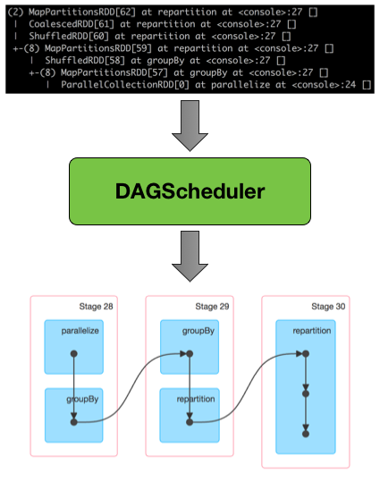
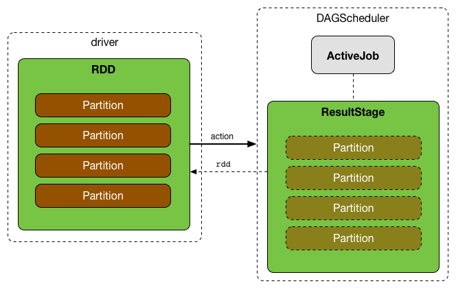
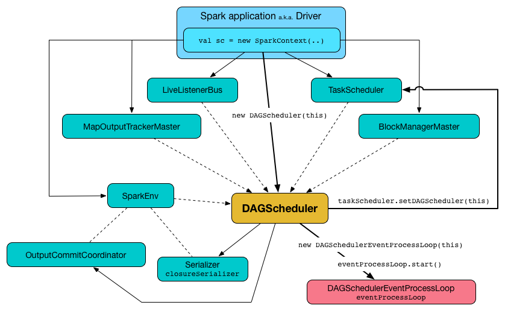
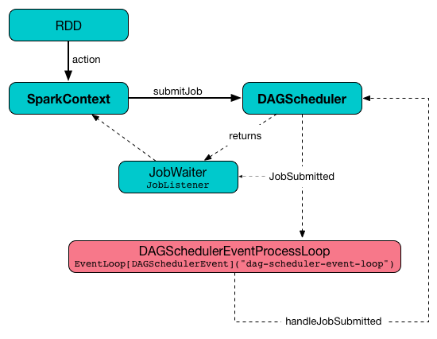

# DAGScheduler

类声明如下：

```scala
/**
 * The high-level scheduling layer that implements stage-oriented scheduling. It computes a DAG of
 * stages for each job, keeps track of which RDDs and stage outputs are materialized, and finds a
 * minimal schedule to run the job. It then submits stages as TaskSets to an underlying
 * TaskScheduler implementation that runs them on the cluster. A TaskSet contains fully independent
 * tasks that can run right away based on the data that's already on the cluster (e.g. map output
 * files from previous stages), though it may fail if this data becomes unavailable.
 *
 * Spark stages are created by breaking the RDD graph at shuffle boundaries. RDD operations with
 * "narrow" dependencies, like map() and filter(), are pipelined together into one set of tasks
 * in each stage, but operations with shuffle dependencies require multiple stages (one to write a
 * set of map output files, and another to read those files after a barrier). In the end, every
 * stage will have only shuffle dependencies on other stages, and may compute multiple operations
 * inside it. The actual pipelining of these operations happens in the RDD.compute() functions of
 * various RDDs
 *
 * In addition to coming up with a DAG of stages, the DAGScheduler also determines the preferred
 * locations to run each task on, based on the current cache status, and passes these to the
 * low-level TaskScheduler. Furthermore, it handles failures due to shuffle output files being
 * lost, in which case old stages may need to be resubmitted. Failures *within* a stage that are
 * not caused by shuffle file loss are handled by the TaskScheduler, which will retry each task
 * a small number of times before cancelling the whole stage.
 *
 * When looking through this code, there are several key concepts:
 *
 *  - Jobs (represented by [[ActiveJob]]) are the top-level work items submitted to the scheduler.
 *    For example, when the user calls an action, like count(), a job will be submitted through
 *    submitJob. Each Job may require the execution of multiple stages to build intermediate data.
 *
 *  - Stages ([[Stage]]) are sets of tasks that compute intermediate results in jobs, where each
 *    task computes the same function on partitions of the same RDD. Stages are separated at shuffle
 *    boundaries, which introduce a barrier (where we must wait for the previous stage to finish to
 *    fetch outputs). There are two types of stages: [[ResultStage]], for the final stage that
 *    executes an action, and [[ShuffleMapStage]], which writes map output files for a shuffle.
 *    Stages are often shared across multiple jobs, if these jobs reuse the same RDDs.
 *
 *  - Tasks are individual units of work, each sent to one machine.
 *
 *  - Cache tracking: the DAGScheduler figures out which RDDs are cached to avoid recomputing them
 *    and likewise remembers which shuffle map stages have already produced output files to avoid
 *    redoing the map side of a shuffle.
 *
 *  - Preferred locations: the DAGScheduler also computes where to run each task in a stage based
 *    on the preferred locations of its underlying RDDs, or the location of cached or shuffle data.
 *
 *  - Cleanup: all data structures are cleared when the running jobs that depend on them finish,
 *    to prevent memory leaks in a long-running application.
 *
 * To recover from failures, the same stage might need to run multiple times, which are called
 * "attempts". If the TaskScheduler reports that a task failed because a map output file from a
 * previous stage was lost, the DAGScheduler resubmits that lost stage. This is detected through a
 * CompletionEvent with FetchFailed, or an ExecutorLost event. The DAGScheduler will wait a small
 * amount of time to see whether other nodes or tasks fail, then resubmit TaskSets for any lost
 * stage(s) that compute the missing tasks. As part of this process, we might also have to create
 * Stage objects for old (finished) stages where we previously cleaned up the Stage object. Since
 * tasks from the old attempt of a stage could still be running, care must be taken to map any
 * events received in the correct Stage object.
 *
 * Here's a checklist to use when making or reviewing changes to this class:
 *
 *  - All data structures should be cleared when the jobs involving them end to avoid indefinite
 *    accumulation of state in long-running programs.
 *
 *  - When adding a new data structure, update `DAGSchedulerSuite.assertDataStructuresEmpty` to
 *    include the new structure. This will help to catch memory leaks.
 */
private[spark]
class DAGScheduler(
    private[scheduler] val sc: SparkContext,
    private[scheduler] val taskScheduler: TaskScheduler,
    listenerBus: LiveListenerBus,
    mapOutputTracker: MapOutputTrackerMaster,
    blockManagerMaster: BlockManagerMaster,
    env: SparkEnv,
    clock: Clock = new SystemClock())
  extends Logging
```

**DAGScheduler** 围绕 stage 进行调度，它将一个 logical execution plan (通过 RDD transformation 构建出依赖关系的 RDD lineage) 转化为一个 physical execution plan (由 stage组合而成)。

下图是：*Figure 1. DAGScheduler Transforming RDD Lineage Into Stage DAG*



触发 action 以后，`SparkContext` 将逻辑执行计划发送给 DAGScheduler，DAGScheduler 将其翻译成一组 stage，作为 TaskSets 提交给 TaskScheduler 执行。

先看几个基本概念：

Job (`class ActiveJob`) 是提交给调度器的最顶层的工作单元。举个例子，用户触发一个action时（比如 `count()`)，Scheduler 使用 `submitJob` 提交一个 Job。每个Job都会执行一些stage，生成中间结果。

Stage (`class Stage`) 是一组并行执行的 task 的集合，每个 task 在 RDD 的不同分区上执行相同的逻辑，生成 Job 的中间结果。不同的Stage 通过 shuffle boundary 划分边界。 shuffle boundary 是概念上的 barrier，它限制了必须在上一个Stage执行完，当前Stage才能去拉取结果。Stage 有两大类：

1. `ResultStage` 是 Job 的最后一个 stage，用于执行一个 action
2. `ShuffleMapStage` 将 map 结果写入文件，供shuffle使用

下图是：*Figure 2. Executing action leads to new ResultStage and ActiveJob in DAGScheduler*


DAGScheduler 只运行在 driver 侧，在 SparkContext 初始化时被创建 (在 `TaskScheduler` 和 `SchedulerBackend` 可用之后)。 下图是 DAGScheduler 被 SparkContext 初始化的过程：



DAGScheduler 做三件事情：
1. 生成 DAG
2. 确定每个 task 执行的位置，一举底层RDD分区的 preferred locations
3. 处理 shuffle文件丢失导致的失败

当对 RDD 执行 action 或者调用 SparkContext.runJob 方法时，DAGScheduler 会调度一个任务，它启动并行执行的 tasks 在对应的分区上执行计算（one task per partition)。

DAGScheduler 为每个 Job 生成一个有向无环图(DAG)，节点是stage，用来追踪哪些 RDD 和 stage 输出被实例化，找到一个最小的调度。然后将 stages 提交到 TaskScheduler。

