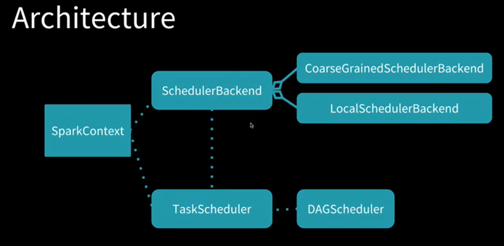
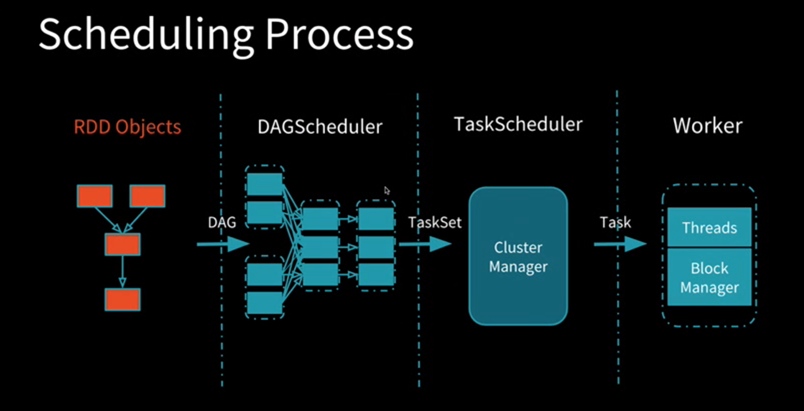
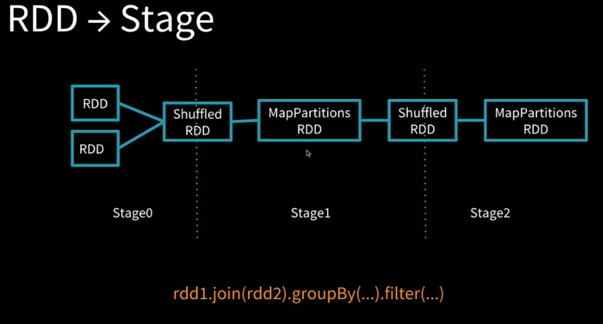

# Spark Scheduler

**Spark Scheduler** 是 Apache Spark 的核心组成部分，负责任务调度。它有两个具体的实现，`DAGScheduler` 负责高层级面向stage的调度，`TaskScheduler` 负责低层级面向task的调度。

调度的架构如图所示：

调度过程如下：

RDD 转化为 Stage：

延伸阅读 [Deep Dive into the Apache Spark Scheduler](https://databricks.com/session/apache-spark-scheduler)。

