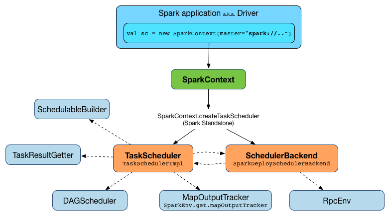

# TaskScheduler

`TaskScheduler` 是一个 interface，它定义了 task 调度的接口。在spark中仅有一个实现：
`org.apache.spark.scheduler.TaskSchedulerImpl` 。每个 TaskScheduler 为一个 SparkContext 执行调度功能。在每个 stage 里，task 调度器从 DAGScheduler 获取带调度的task，负责将这些task发送给集群、执行task、失败重试、mitigating stragglers。他们返回events 给 DAGScheduler。

