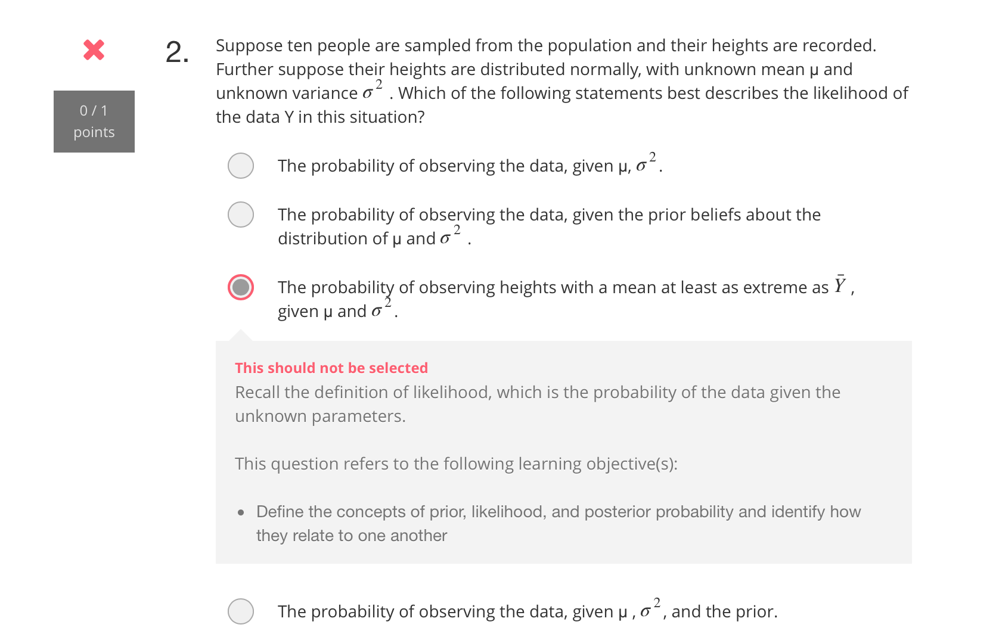
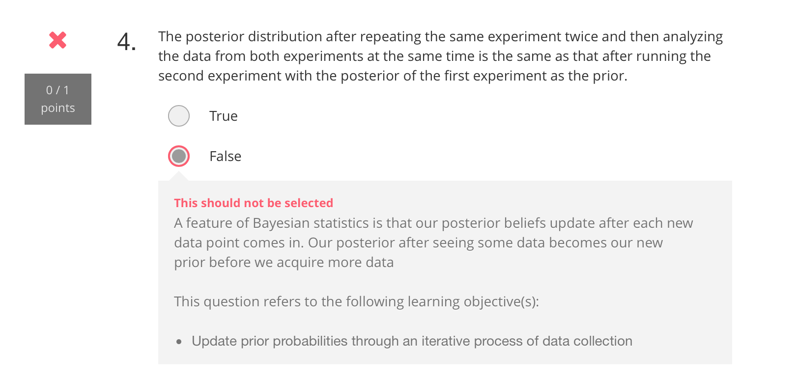
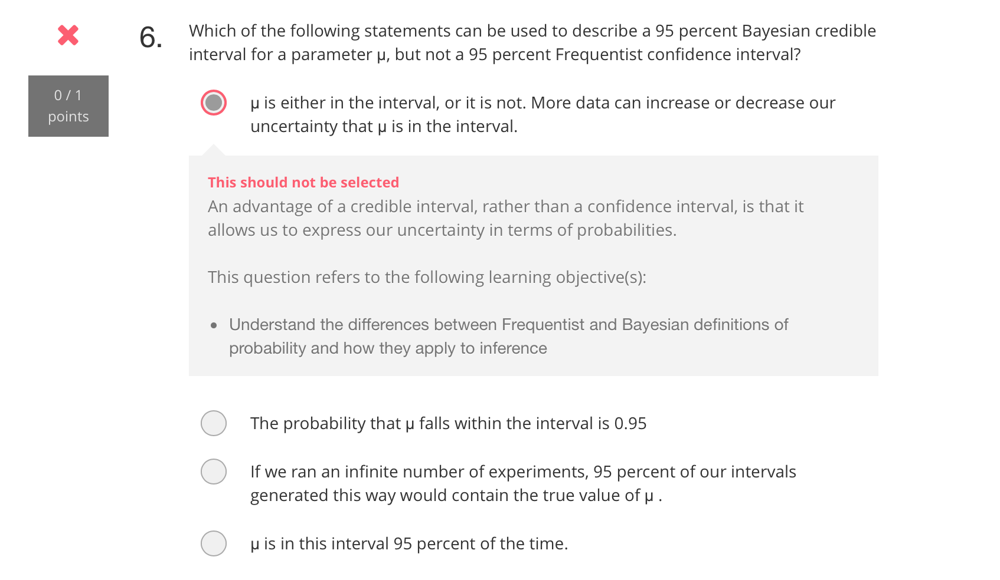
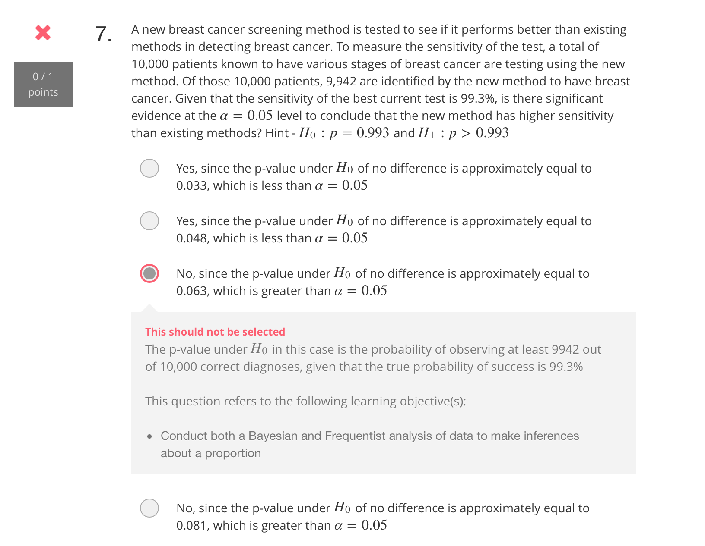
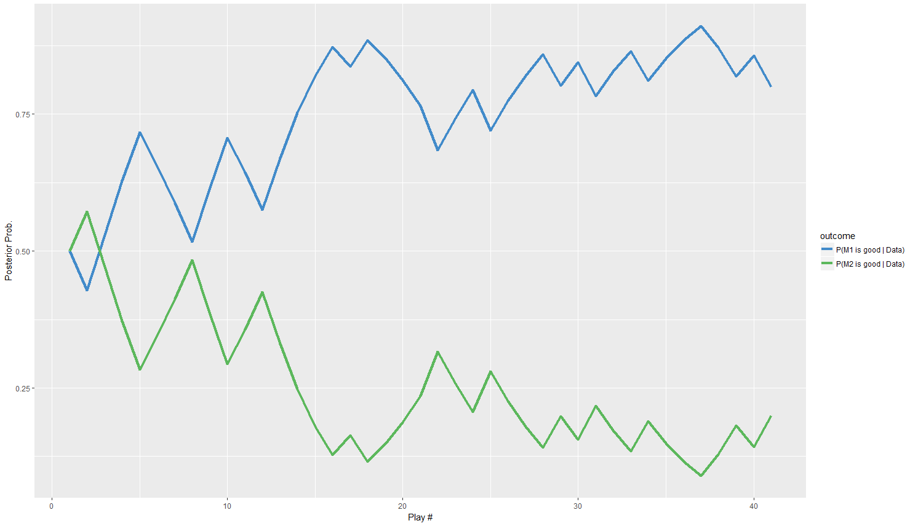

# Introduction to Bayesian Statistics

## Bayes' Rule

$$P(A|B) = \frac{P(A\&B)}{P(B)}$$

## Bayesian vs. Frequentist Definitions of Probability

As to frequentist, probability is defined as:

$$P(E) = \lim_{n\to\infty}{n}$$

defined as the proportion of times the event occurs at n trials when n goes to infinity.

Probability based on your degree of belief, is the Bayesian definition.

To further explain their difference, we check some additional concepts.


**Confidence Interval** only exists in frequentist methods of inference, defined as the proportion of random samples of size n from the `same` population that produces confidence intervals that contain the true population parameter (Chapter 4.2).

**Wrong**: The interpretation of confidence level as the probability that a given interval contains the population parameter is `incorrect`.  (It's not about any given interval, it's about all intervals)

**Credible Interval** exists in Bayesian methods, it
1. allows us to describe the unknown true parameter not as a fixed value but with a probability distribution.
2. this will let us construct something like a confidence interval, except we can make probabilistic statements about the parameter falling within that range.

## Inference for a Proportion

**p-value**: probability of the observed or more extreme outcome given that the null hypothesis is true.

### posterior probability

use Bayes' rule to calculate the posterior probability, i.e. $P(model|data)$

$$
P(model|data) = \frac{P(model\&data)}{P(data)}= 
\frac{P(data|model)\times P(model)}{P(data)}
$$

here is the code to calculate posterior probability:

```{r}
numerator <- prior * likelihood
denominator <- sum(numerator)
posterior <- numerator/denominator
sum(posterior)  # should be 1
```

Here, the `sum` is used to check the results.


## Error Quiz






## Findings on R

Note how data pipeline is constructed: the param of variable `prior` is `dot`

```{r}
data1 = data.frame(machine=c(1L), outcome=c("W"))
data2 = data.frame(machine=c(1L), outcome=c("L"))
bandit_posterior(data1) %>% bandit_posterior(data2, prior=.)
```

Draw a graph with `plot_bandit_posterior`

```{r}
function (data, prior = c(m1_good = 0.5, m2_good = 0.5), win_probs = c(good = 1/2, 
  bad = 1/3)) 
{
  r = dplyr::data_frame(`P(M1 is good | Data)` = rep(NA, nrow = nrow(data) + 
    1), `P(M2 is good | Data)` = rep(NA, nrow = nrow(data) + 
    1))
  r[1, ] = prior
  for (i in 1:nrow(data)) r[i + 1, ] = bandit_posterior(data[1:i, 
    ], prior, win_probs)
  r = dplyr::mutate(r, play = 1:n())
  r = tidyr::gather(r, outcome, prob, -play)
  ggplot(r, aes_string(x = "play", y = "prob", color = "outcome")) + 
    geom_line(size = 1.5) + labs(x = "Play #", y = "Posterior Prob.") + 
    scale_color_manual(values = c("#428bca", "#5cb85c"))
}
```

Demo:

