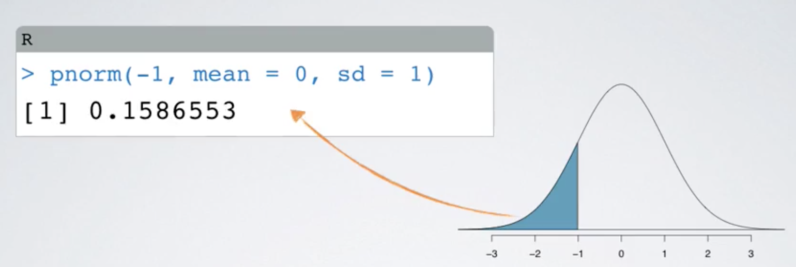

# Probability Distributions


## Normal Distributions

### 1. Computing percentile - using R  

#### 1.1 `pnorm` computes percentile based on value

```
pnorm(-1, mean=0, sd=1)
```



#### 1.2 `qnorm` computes value based on percentile

```
qnorm(0.9, mean=1500, sd=300)
```


2. Using applet to simulate Distribution

[Distribution Calculator](https://gallery.shinyapps.io/dist_calc/ "Distribution Calculator")

