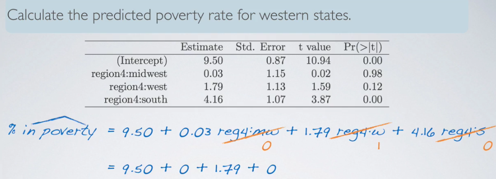

# About Linear Regression and Modeling

## Correlation

**Correlation: strength of a linear relationship**. We denote the correlation by R.

Properties:

  1. the `magniture (absolute value)` of the correlation coefficient measures the strength of the linear association between two numerical variables;
  2. the sign of the correlation coefficient indicates the direction of association;
  3. the correlation coefficient is [-1,1]; 0 means no linear relationship;
  4. the correlation coefficient is unitless, and is not affected by changes in the center or scale of either variable (such as unit conversions);
  5. the correlation of X with Y is the same as of Y with X;
  6. the correlation coefficient is sensitive to outliers;

[Correlation: Pearson's production-moment coefficient](https://en.wikipedia.org/wiki/Correlation_and_dependence#Pearson's_product-moment_coefficient "coef")

## Residuals

Definition: difference between the observed and predicted y

$$ e_{i} = y_{i} - \hat{y_{i}} $$

## Least squares line

$$ \hat{y} = \beta_{0} + \beta_{1}x$$

Slope:

Intercept:

Think of slope and intercept as together, which is

## Prediction and Extrapolation

What is prediction?

Using the linear model to predict the value of the response variable for a given value of explanatory variable is called `prediction`.

What is extrapolation?

Applying a model estimate to values outside of the realm of the original data is called `extrapolation`.

## Conditions for Linear Regression

1. linearity
    * relationship between the explanatory and the response variable should be linear
    * methods for fitting a model to non-linear relationships exist
    * check using a scatterplot of the data, or a `residuals plot`

    Check the graph for some examples:

    

    

2. nearly normal residuals
    * residuals should be nearly normally distributed, centered at 0
    * may not be satisfied if there are unusual obervations that don't follow the trend of the rest of the data
    * check using a histogram or normal probability plot of residuals

    here is a sample graph

    

3. constant variability
    * variability of points around the least squares line should roughly constant
    * implies that the variability of residuals around the 0 line should be roughly constant as well
    * also called `homoscedasticity`
    * check using a residuals plot

    

    [check the exercises here](https://gallery.shinyapps.io/slr_diag/ "exercise")

    here is a example which curved up:

    

## Square of Correlation $R^2$

What does $R^2$ means?

* strength of the fit of a linear model is most commonly evaulated using $R^2$
* calculated as the square of the correlation coefficient
* tells us what percent of variability in the response variable is explained by the model
* the reminder of the variability is explained by variables not included in the model
* always between 0 and 1

## Regression with Categorical Explanatory Variables

take `poverty v.s. region` as example

explanatory variable: region
 0 - eest
 1 - west

