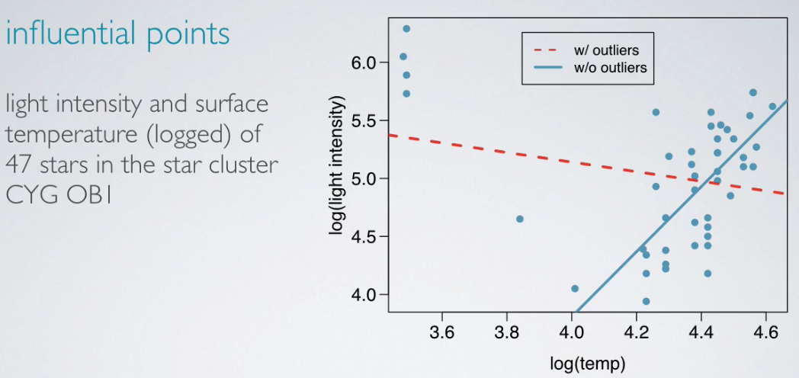

# Outliers & Inference for Regression

## Outliers

* `outliers` are points that fall away from the cloud of points
* outliers that fall horizentally away from the center of the cloud but don't influence the slope of the regression line are called `leverage points`
* outliers that actually influence the slop of the regression line are called `influential points`
    1) usually high leverage points
    2) to determine if a point is influential, viualize the regression line with and without the point, and ask: Does the slope of the line change considerably?

Here is an example of influential points

## Testing for the slop - hypothesis

Is the explanatory variable a significant predictor of the response variable?

$H_{0}$ (nothing going on): The explanatory variable is not a significant predictor of the response variable, i.e. no relationship $\to$ slope of the relationship is 0.

$H_{A}$ (something going on): The explanatory variable is a significant predictor of the response variable, i.e. relationship $\to$ slope of the relationship is different than 0.

Written in formula as:

$$H_{0}: \beta_{1} = 0$$
$$H_{A}: \beta_{1} \neq 0$$

use t-statistic in inference for regression, the formula is:

$$ T = \frac{point\ estimate - null\ value}{SE}$$

for the slope variable, we use a similar formula:

$$ T = \frac{b_{1} - 0}{SE_{b_{1}}}; df = n-2$$

Why `df = n-2`, because we have $\beta_{0}$ and $\beta_{1}$.

## Caution

1. Always be aware of the type of data you're working with: random sample, non-random sample, or population
2. Statistical inference, and the resulting p-values, are meaningless when you already have population data.
3. If you have a sample that is non-random (biased), the results will be unreliable.
4. The ultimate goal is to have independent observations - and you know how to check for those by now.

## Variability Partitioning

So far, t-test as a way to evaluate the strength of evidence for a hypothesis test for the slope of relationship between x and y.  Alternatively, consider the variability in y `explained by` x, compared to the `unexplained variability`.

`Partioning` the variability in y to explained and unexplained variability requires `analysis of variance (ANOVA)`.

Here is an example output of ANOVA analysis:

### $R^2$ and variability

* $R^2$ is the proportion of variability in y explained by the model:
    * large $\to$ linear relationship between x and y exists
    * small $\to$ evidence provided by the data may not be convincing

* Two ways to calculate $R^2$
    1) using correlation: square of the correlation coefficient
    2) from the definition: proportion of explained to total variability
