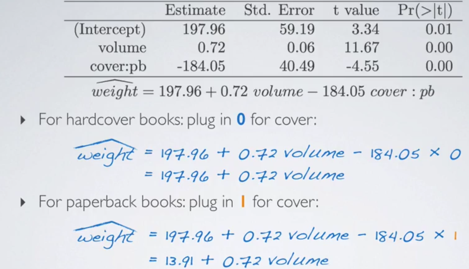
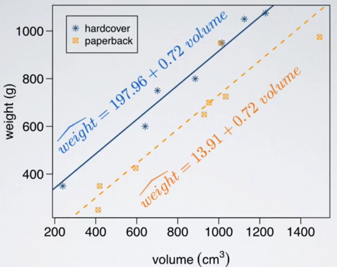

# Regression with Multiple Predictors

## What is `Reference Level`?

The reference level is the base-line. If you wanted to predict probability of 'Yes', you'd set the base-line (i.e. reference level) "No".

In the example, hardcover is the reference level.






## Adjusted $R^2$

use ANOVA to explain $R^2$:


Definition of Adjusted $R^2$:

$$R_{adj}^{2} = 1- (\frac{SSE}{SST}\times\frac{n-1}{n-k-1})$$
, where k is the number of predictors

Propertitis of Adjusted $R^2$:

1. k is never negative $\to$ adjusted $R^2$ to $R^2$;
2. adjusted $R^2$ applies a penalty for the numbers of predictors in the models;
3. we choose models with higher adjusted $R^2$ over others;

## Collinearity

1. Two predictor variables are said to be `collinear` when they are correlated with each other;
2. Remember: Predictors are also called independent variables, so they should be independent of each other.
3. Inclusion of collinear predictors (also called `multicollinearity`) complicates model estimation.

## Parsimony

1. Avoid adding predictors associated with each other because often times the addition of such variable brings nothing new to the table
2. Prefer the simplest best model, i.e. the  `parsimonious model`
    * Occam's razor: among competing hypothesis, the one with the fewest assumptions should be selected
3. Addition of collinear variables can result in biased estimates of the regression parameters
4. While it's impossible to avoid collinearity from arising in observational data, experiments are usually designed to control for correlated predictors.

## Inference for MLR

```{r dasi_cognitive}
# load data
cognitive = read.csv("http://bit.ly/dasi_cognitive")

# full model
cog_full = lm(kid_score ~ mom_hs + mom_iq + mom_work + mom_age, data=cognitive)

summary(cog_full)
```

Hypothesis is as the follow for the above example:

$$ H_{0}: \beta_{1} = \beta_{2} = ... = \beta_{k} = 0 $$
$$ H_{A}: \text{At least one }\beta_{i}\text{ is different than 0} $$

We can check the result and the interpretation in the picture.


we use the testing for the slope to verify the hypothesis (t-statistic).  We know t-statistic is defined as: 

$$ T = \frac{\text{point estimate} - \text{null value}}{SE} $$

Then we can define the t-statistic for the slope:

$$ T = \frac{b_{1} - 0}{SE_{b_{1}}}, df = n-k-1$$

Here k is the number of predictors.

## How to calculate the confidence interval?

Formula: point estimate $\pm$ margin of error

$$b_{1} \pm t_{df}^{*}SE_{b_{1}}$$


In the example we got $2.54\pm19.7\times2.35\approx(-2.09,7.17)$.  We can interpret the interval as: We are 95% confident that, all else being equal, the model predicts that children whose moms worked during the first three years of their lives score 2.09 points lower to 7.17 points higher than whose moms did not work.

## Model Selection

### Stepwise model selection

1. `backwards elimination`: start with a `full model` (containing all predictors), drop one predictor at a time until the parsimonious model is reached

2. `forward selection`: start with an empty model and add one predictor at a time until the parsimonious model is reached.

**Criteria**:

  1. p-value, adjusted $R^2$
  2. AIC, BIC, DIC, Bayes factor, Mallow's $C_{p}$(beyond the scope of this course)

First, let's talk about `backwards elimination`, the procedure of **Backwards elimination** (adjusted $R^2$) is:

  1. Start with the full model
  2. Drop one variable at a time and record adjusted $R^2$ of each smaller model
  3. Pick the model with the highest increase in adjusted $R^2$
  4. Repeat until none of the models yield an increase in adjusted $R^2$

Here is an example with raw selection step:


We have better solution with the p-value table from `summary()`:


If you have a categorical variable with multiple levels, you cannot drop some of the level of the variable and keep the others.  You have to either keep all as a whoe, or drop all.


**Backwards Elimination**: adjusted $R^2$ v.s. p-value

1. p-value: significant predictors
2. adjusted $R^2$: more reliable predictions
3. p-value method depends on the (somewhat arbitray) 5% significance level cutoff
    * different significance level $\to$ different model
    * used commenly since it requires fitting fewer models(in the more commonly used backwards-selection approach)

Then, let's check `forward selection` (adjusted $R^2$).


The procedure of forward selection (`adjusted $R^2$`) is:

1. Start with single predictor regressions of response v.s. each explanatory variable
2. Pick the model with the highest adjusted $R^2$
3. Add the remaining variables one at a time to the existing model, and pick the model with the highest adjusted $R^2$

Here I do not give an example for forward selection with p-value, but give the procedure.

The procedure of forward selection (`p-value`) is:

1. Start with single predictor regressions of response v.s. explanatory variable
2. Pick the variable with the lowest significant p-value
3. Add the remaining variables one at a time to the existing model, and pick the variable with the lowest significant p-value
4. Repeat until any of the remaining variables do not have a significant p-value

Finally, we introduce `expert opinion`, it's esp. used in some conditions.

After feature selection, we give the final model, here is an example:


## Diagnostics for MLR

1. linear relationships between (numerical) x and y
    * each (numerical) explanatory variable linearly related to the response variable
    * check using residual plots (e vs. x)
2. nearly normal residuals with mean 0
    * some residuals will be positive and some negative
    * on a residuals plot we look for random scatter of residuals around 0
    * this translates to a nearly normal distribution of residuals centered at 0
    * check using histogram or normal probability plot (`hist`, `qqnorm`, `qqline`)
3. constant variability of residuals

```{r}
plot(cog_final$residuals - cog_final$fitted)
plot(abs(cog_final$residuals) - cog_final$fitted)
```

4. independent residuals
    * independent residuals $\to$ independent observations
    * if time series structure is suspected check using residuals vs. order of data collection
    * if not, think about how data are sampled

## Frequently Used Functions

1. pairwise plot: `ggpairs(evals, columns = 13:19)`
2. Residuals plot: `plot(cog_finals$residuals ~ cognitive$mom_iq)`
3. Scatter plot: `plot`, `ggplot ... + geom_point()`

## Questions I have done wrongly

